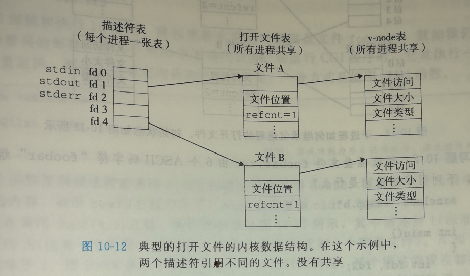
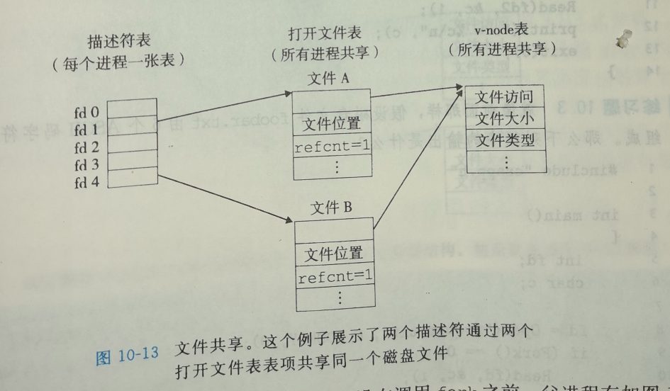
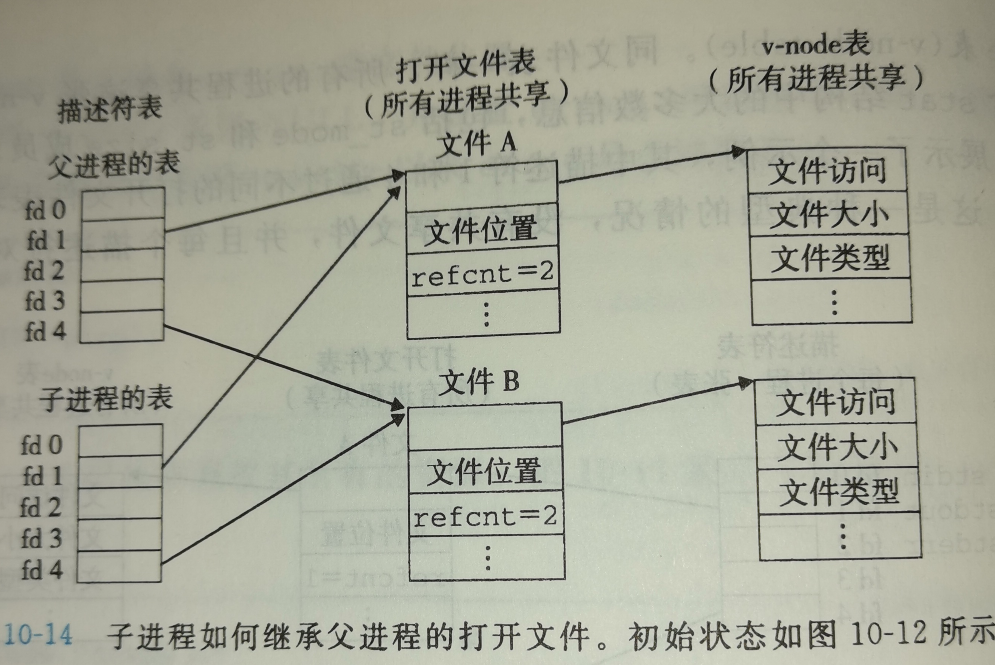

## 第10章 系统级 I/O

[TOC]

------

### 10.1 Unix I/O

Linux 将所有的I/O设备模型化为文件，使得所有输入输出都能同一方式执行：

- 打开文件，应用程序通过要求内核打开相应的文件，来宣告它想要访问一个I/O设备。内核返回一个称为 **描述符** 的小的非负整数
- Linux shell 创建的每个进程默认都有三个打开的文件：标准输入( 0 ), 标准输出( 1 ), 错误输出( 2 )。头文件<unistd.h> 定义了常量 STDIN_FILENO、STDOUT_FILENO、STDERR_FILENO
- 改变当前的文件位置。内核保持着一个文件位置k，初始化为0，表示字节偏移量，应用程序可以通过seek显式地设置k
- 读写文件。当k>=文件结束位置时，触发（EOF）
- 关闭文件 。无论一个进程处于何种原因终止，内核都将关闭其打开的文件


------

### 10.2 文件

- 普通文件，包含任意数据。应用程序常常要区分文本文件和二进制文件，但对于内核而言，这并没有区别，linux 的换行符时'\n'，值为0x0a
- 目录，是包含一组链接的文件，其中每个连接都将一个文件名映射到一个文件，这个文件可能是另外一个目录。每个目录至少含有两个条目："." 和 “..”，分别指向当前目录和上一级目录。
- 套接字，是用来与另一个进程进行跨网络通信的文件


------

### 10.3 打开和关闭文件

```c
#include <sys/types.h>
#include <sys/stat.h>
#include <fcntl.h>

int open(char *filename, int flags, mode_t mode);//若成功则返回新文件描述符，若出错则为-1
```

```c
fd = Open("foo.txt", O_WRONLY | O_APPEND, 0);//
```


```c
#define DEF_MODE S_IRUSR | S_IWUSR | S_IRGRP | S_IWFRP | S_IROTH | S_IWOTH
#define DEF_UMASK S_IWGRP | S_IWOTH

umask(DEF_UMASK);
fd = open("foo.txt", O_CREAT | O_TRUNC | O_RWONLY, DEF_MODE );//文件的访问权限被设置为 mode & ~mask
```


------

### 10.4 读写文件

```c
#include <unistd.h>

ssize_t read(int fd, void *buf, size_t n);//成功则返回读的字节数，EOF则为0， 出错则为-1
ssize_t write(int fd, const void *buf, size_t n);//成功则为写的字节数，出错则为-1
```


------

### 10.5 用RIO包健壮地读写

Robust I/O，健壮的I/O包


#### RIO 的无缓冲的输入输出函数

```c
#include <csapp.h>

ssize_t rio_readn(int fd, void *usrbuf, size_t n);
ssize_t rio_writen(int fd, void *usrbuf, size_t n);
	//成功则返回传送的字节数，若EOF则为0（rio_redn）, 出错则返回-1

ssize_t rio_readn(int fd, void *usrbuf, size_t n) 
{
    size_t nleft = n;	//代表剩余字节数
    ssize_t nread;		//代表单次读取的字节数
    char *bufp = usrbuf;//读指针

    while (nleft > 0) {
        if ((nread = read(fd, bufp, nleft)) < 0) {//
            if (errno == EINTR) /* interrupted by sig handler return 系统调用中断*/
                nread = 0;      /* and call read() again */
            else
                return -1;      /* errno set by read() */ 
        } 
        else if (nread == 0)
            break;              /* EOF */
        nleft -= nread;
        bufp += nread;
    }
    
    return (n - nleft);         /* return >= 0 */
}

ssize_t rio_writen(int fd, void *usrbuf, size_t n) 
{
    size_t nleft = n;
    ssize_t nwritten;
    char *bufp = usrbuf;

    while (nleft > 0) {
        if ((nwritten = write(fd, bufp, nleft)) <= 0) {
            if (errno == EINTR)  /* interrupted by sig handler return */
           		nwritten = 0;    /* and call write() again */
            else
           		return -1;       /* errno set by write() */
        }
        nleft -= nwritten;
        bufp += nwritten;
   	}
    return n;
}
```


#### RIO 的带缓冲的输入函数

```c
#include <csapp.h>

void rio_reainitb(rio_t *rp, int fd);

ssize_t rio_realineb(rio_t *rp, void *usrbuf, size_t maxlen);
ssize_t rio_readnb(rio_t *rp, void *usrbuf, size_t n);
	//成功则返回读的字节数，若EOF则为0， 若出错则为-1


static ssize_t rio_read(rio_t *rp, char *usrbuf, size_t n)
{
    int cnt;

    while (rp->rio_cnt <= 0) {  /* refill if buf is empty */
	    rp->rio_cnt = read(rp->rio_fd, rp->rio_buf, 
			   sizeof(rp->rio_buf));    //初始化内部缓冲区
        if (rp->rio_cnt < 0) {          //初始化缓冲区失败
            if (errno != EINTR)         //非系统调用中断导致初始化内部缓冲区失败
                return -1;
	    }
        else if (rp->rio_cnt == 0)      //用户文件结束
            return 0;
        else 
            rp->rio_bufptr = rp->rio_buf; //重置缓冲区读指针到新缓冲内容，因为缓冲区的更新通过新建数组完成，所以读指针必须指向新的缓冲字符串
    }

    /* Copy min(n, rp->rio_cnt) bytes from internal buf to user buf */
    cnt = n;                               
    if (rp->rio_cnt < n)    //条件传送
	    cnt = rp->rio_cnt;
    memcpy(usrbuf, rp->rio_bufptr, cnt);    //将内部缓冲区的cnt字节复制到用户缓冲区
    rp->rio_bufptr += cnt;                  //读指针后移到第一个未读字节
    rp->rio_cnt -= cnt;                     //设置未读字节数
    return cnt;                             //返回实际读缓冲区字节数
}
/* $end rio_read */

/*
 * rio_readinitb - Associate a descriptor with a read buffer and reset buffer
 */
/* $begin rio_readinitb */
void rio_readinitb(rio_t *rp, int fd) 
{
    rp->rio_fd = fd;                //文件描述符
    rp->rio_cnt = 0;                //缓冲区未读字节数
    rp->rio_bufptr = rp->rio_buf;   //缓冲区读指针
}
/* $end rio_readinitb */

/*
 * rio_readnb - Robustly read n bytes (buffered)
 */
/* $begin rio_readnb */
ssize_t rio_readnb(rio_t *rp, void *usrbuf, size_t n) 
{
    size_t nleft = n;
    ssize_t nread;
    char *bufp = usrbuf;
    
    while (nleft > 0) {
	if ((nread = rio_read(rp, bufp, nleft)) < 0) {
	    if (errno == EINTR) /* interrupted by sig handler return */
		nread = 0;      /* call read() again */
	    else
		return -1;      /* errno set by read() */ 
	} 
	else if (nread == 0)
	    break;              /* EOF */
	nleft -= nread;
	bufp += nread;
    }
    return (n - nleft);         /* return >= 0 */
}
/* $end rio_readnb */

/* 
 * rio_readlineb - robustly read a text line (buffered)
 */
/* $begin rio_readlineb */
ssize_t rio_readlineb(rio_t *rp, void *usrbuf, size_t maxlen) 
{
    int n, rc;
    char c, *bufp = usrbuf; //当前写入用户缓存字节，当前写入用户缓冲指针

    for (n = 1; n < maxlen; n++) { 
        if ((rc = rio_read(rp, &c, 1)) == 1) {  //从缓冲区读取一个字节，如果成功，第二次调用不会陷入内核
            *bufp++ = c;
            if (c == '\n')                      
                break;
	    } else if (rc == 0) {
	        if (n == 1)
		        return 0; /* EOF, 说明第一次内部缓冲区读已经遇到EOF */
	        else
		        break;    /* EOF, 否则说明遇到正常的EOF */
        } else
            return -1;	  /* error */
    }
    *bufp = 0;              //设置EOF
    return n;               //返回已写入用户缓冲区字节数，不含EOF
}
```


#### 读取文件元数据

```c
#include <unistd.h>
#include <sys/stat.h>

int stat(const char *filename, struct stat *buf);
int fstat(int fd, struct stat *buf);
	//成功返回0，出错则返回-1
```


```c
/* $begin statcheck */
#include "csapp.h"

int main (int argc, char **argv) 
{
    struct stat stat;
    char *type, *readok;

    /* $end statcheck */
    if (argc != 2) {
	fprintf(stderr, "usage: %s <filename>\n", argv[0]);
	exit(0);
    }
    /* $begin statcheck */
    Stat(argv[1], &stat);
    if (S_ISREG(stat.st_mode))     /* Determine file type */
	type = "regular";
    else if (S_ISDIR(stat.st_mode))
	type = "directory";
    else 
	type = "other";
    if ((stat.st_mode & S_IRUSR)) /* Check read access */
	readok = "yes";
    else
	readok = "no";

    printf("type: %s, read: %s\n", type, readok);
    exit(0);
}
/* $end statcheck */
```


------

### 10.7 读取目录内容

```c
#include <sys/types.h>
#include <dirent.h>

DIR *opendir(const char *name);//成功则返回处理的指针，错误返回NULL
```


### 10.8 共享文件

- 描述符表，每个进程都有自己独立的描述符表。
- 文件表，所有进程共享一张文件表
- v-node表 （v-node table）所有进程共享




同一进程两次打开用一个文件




fork()




------

### 10.9 I/O重定向

```c
#include <unistd.h>

int dup2(int oldfd, int new fd);//将oldfd的表项复制到newfd的表项，返回飞赴的描述符，出错则返回-1
```

比如 ls > foo.txt, 将ls输出到标准输出重定向为输出到文件foo.txt, 覆盖模式


```c
#include <csapp.h>

int main(){

    char c;
    int f1, f2 ;

    f1 = Open("./foobar.txt", O_RDONLY, 0);
    f2 = Open("./foobar.txt", O_RDONLY, 0);

    Read(f1, &c, 1);
    dup2(f2, f1);
    Read(f2, &c, 1);

    printf("c = %c \n", c);

    exit(0);

}

//foobar.txt 内容：foobar
```

```shell
[root@localhost test]# gcc dup2.c -lcsapp
[root@localhost test]# ./a.out
c = f 
```


------

### 10.10 标准I/O

每个ANSI C程序都有三个打开的流 stdin、stdout、stderr

```c
#include <stdio.h>
//FILE 为 FILE结构
extend FILE *stdin;
extend FILE *stdout;
extend FILE *stderr;
```

流FILE 是对文件描述符和流缓冲区的抽象，与RIO的缓冲区一样，都是为了减少开销比较高的系统调用I/O(陷阱)


