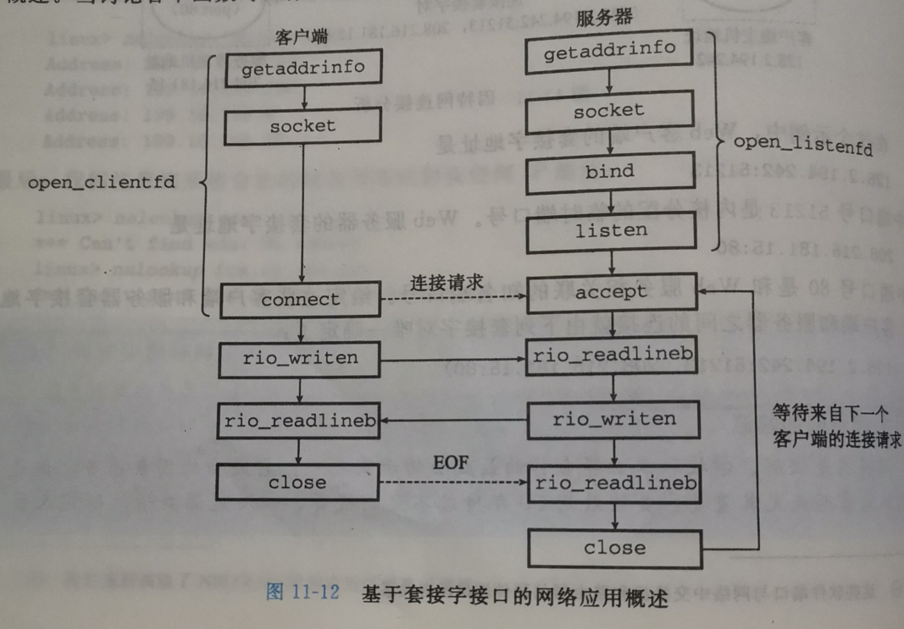
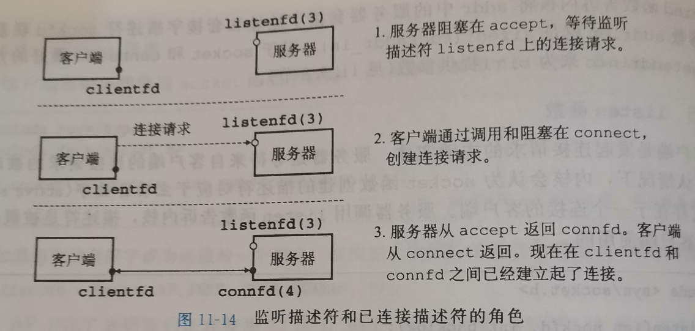
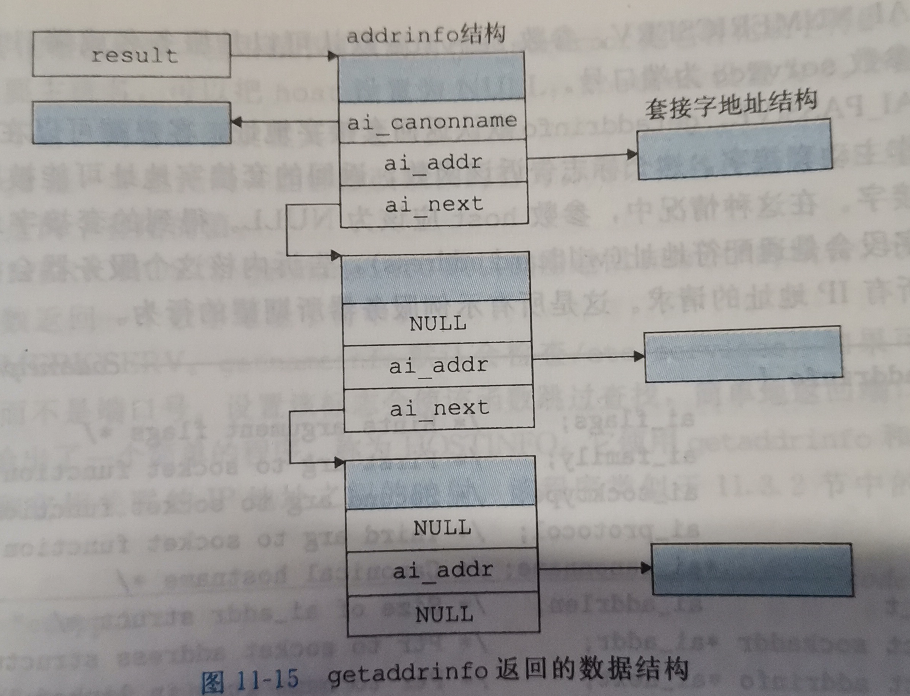

## 第11章 网络编程

[toc]

------

### 11.1 客户端-服务端编程模型

基本操作：事务


服务端一般负责管理资源，比如磁盘文件


客户端和服务端是进程，他们可以是同一台主机，也可以是不同主机。


------

### 11.2 网络


------

### 11.3 IP 地址

```c
#include <arpa/inet.h>

int inet_pton(AF_INET, const char *src, void *dst);//src为字符串，成功返回1，src非法则返回0，出错返回-1
const char *inet_ntop(AF_INET, const void *src, char *dst, socklen_t size);//src为in_addr结构，成功返回指向点分十进制字符串，出错则为NULL
```

TCP/IP为任意整数数据项定义了统一的**网络字节顺序**（大端法）

在IP地址结构中的地址总是按照大端法顺序存放

```c
struct in_addr{
  uint32_t s_addr;//大端法  
};
```


#### 因特网连接

一个套接字是连接的一个端点，都有相应的套接字地址，由域名和端口号组成


知名端口和知名服务名的映射 `/etc/services`


一个套接字对确定一个连接：(cliaddr:cliport, servaddr:servport)


#### 套接字接口

**套接字接口（socket interface）**是一组函数





#### 套接字地址结构

```c
struct sockaddr_in{
    uint16_t 		sin_family;		//协议族，比如AD_INET,也就是IPv4
    uint16_t 		sin_port;		//端口号，网络字节顺序（大端法）
    struct in_addr	sin_addr;		//ip地址，网络字节顺序（大端法）
    unsigned 		sin_zero[8];	//
}
//简化为：
struct sockaddr{
    uint16_t 	sa_family;			//协议族
    char		sa_data[14];		//地址数据
}
```


#### socket 函数

```c
#include <sys/types.h>
#include <sys/socket.h>

int socket(int domin, int type, int protocol);
//举例
clientfd = Socket(AF_INET, SOCK_STREAM, 0);//返回客户端描述符
```


#### connetct 函数

客户端通过调用connetct 函数建立和服务器的连接

```c
#include <sys/socket.h>

int connect(int clientfd, const struct sockaddr *addr, socklen_t addrlen);//成功则返回0， 出错则返回-1
```

connet函数会阻塞直至连接成功建立或发生错误


得到的连接是由套接字对刻画的


#### bind 函数

```c
#include <sys/socket.h>

int bind(int sockfd, const struct sockaddr *addr, socklen_t addrlen);//成功返回0， 出错返回-1
```


#### listen 函数

```c
#include <sys/socket.h>

int listen(int sockfd, int backlog);//成功返回0，出错返回-1
```


#### accept 函数

```c
#include <sys/socket.h>

int accept(int listenfd, struct sockaddr *addr, int *addrlen);//成功返回非负的连接描述符，出错则为-1
```




 

#### 主机与服务的转换

##### getaddrinfo 函数：

- 是已弃用的gethostbyname和 getservbyname函数的新替代品

- ```c
  #include <sys/types.h>
  #include <sys/socket.h>
  #include <netdb.h>
  
  int getaddrinfo(
  	const char*				host,		//主机名，可以是域名，也可以是点分十进制地址
      const char*				service,	//服务名，可以是服务名，也可以是端口号
      const struct adddrinfo*	hints,		//一个addrinfo结构，可选字段，对套接字地址结构更好的控制。
      struct addrinfo**		result		//需要被遍历的套接字链表
  );//成功则返回0，出错则返回非负错误代码
  
  void freeaddrinfo(struct addrinfo* result);//释放链表
  
  const char* gai_strerror(int errcode);	//转换错误消息
  
  
  ```

- getaddrinfo数据结构：

  


**hints 设置字段**：

- ai_family: 限制getaddrinfo函数返回的套接字地址结构中的ai_family,例如ai_family = AF_INET,设置为IPv4,AF_INET6 设置为IPv6
- ai_socktype: 可以设置为SOCK_STREAM,限制addrinfo链表最多只有一个条目，作为连接的端点
- ai_flags: 位掩码
  - AI_ADDRCONFIG,要求主机只有当本地主机被配置为IPv4时，getaddrinfo返回IPv4地址。IPv4类似
  - AI_cANONNAME, 将addrinfo第一个结构的ai_canonname字段指向host权威域名
  - AI_NUMERICSERV, 强制参数service为端口号
  - AI_PASSIVE, 告诉函数返回的套接字地址可能被服务器用作监听套接字。此时host应该为NULL，得到的套接字地址结构中的地址字段将会时通配符，\*.\*.\*.*


```c
struct addrinfo{
    int 			ai_flags;		//hints参数
    int 			ai_family;		//函数第一个参数
    int 			ai_socktype;	//函数第二个参数
    int 			ai_protocol;	//桉树第三个参数
    int				*ai_canonname;	//权威服务名
    size_t			ai_addrlen;		//套接字地址结构的大小
    struct sockaddr *ai_addr;		//套接字地址结构
    struct addrinfo *ai_next;		//指向链表下一个节点
}
```

当getaddrinfo 创建输出列表中的addrinfo时，会填写每个字段除了ai_flags。

addrinfo结构封装，使得编写的客户端和服务器能够独立于某个特殊版本的IP协议


##### getnameinfo 函数

与getaddrinfo函数相反

gethostbyaddr和getservbyport函数的新替代品

```c
#include <sys/socket.h>
#include <netdb.h>

int getnameinfo(
	const struct sockaddr*	sa,			
    socklen_t				salen,
    char*					host,
    size_t					hostlen,
    char*					service,
    size_t					servlen
    int						flags
)
```

flags:

- NI_NUMERICHOST, 默认返回host中的域名，设置此标志将使函数返回一个数字地址字符串
- NI_NUMERICSERV, getnameinfo函数默认检查/etc/services,如果可能，会返回服务名，而不是端口号,设置该标志将简单地返回端口号


```c
#include <csapp.h>

int main(int argc, char** argv){
    
    struct addrinfo *p;     //temp
    struct addrinfo *listp; //接收getaddrinfo的结果
    struct addrinfo hints;  //限制条件
    char buf[MAXLINE];
    int rc, flags;

    if( argc != 2){
        fprintf(stderr, "usage:%s <domain name> \n", argv[0]);
        exit(0);
    }

    memset(&hints, 0, sizeof(struct addrinfo));                         //清空
    hints.ai_family = AF_INET;                                          //设置为只接受IPv4
    hints.ai_socktype = SOCK_STREAM;                                    //套接字流
    if ( ( rc = getaddrinfo(argv[1], NULL, &hints, &listp) ) != 0 ){    //地址可以是域名，也可以使点分十进制地址，查询主机套接字
        fprintf(stderr, "getaddrinfo error:%s \n", gai_strerror(rc));
        exit(0);
    }

    flags = NI_NUMERICHOST;         //将主机名转换为数字地址字符串
    for( p = listp; p; p = p->ai_next ){
        getnameinfo(p->ai_addr, p->ai_addrlen, buf, MAXLINE, NULL, 0, flags);//将套接字地址的主机信息提取出来
        printf("%s \n", buf);
    }

    freeaddrinfo(listp);            //释放套接字地址链表

}
```

```shell
[root@localhost test]# gcc hostinfo2.c -lcsapp
[root@localhost test]# ./a.out www.qq.com
113.96.232.215 
14.18.175.154 
```


#### 套接字接口的辅助函数

```c
#include <csapp.h>

int open_clientfd( char* hostname, char* port ){

    int clientfd;
    struct addrinfo hints;      //限制getaddrinfo的结果
    struct addrinfo *listp;
    struct addrinfo *p;

    memset( &hints, 0, sizeof(struct addrinfo) );
    hints.ai_socktype = SOCK_STREAM;
    hints.ai_flags = AI_NUMERICSERV |                   //设置服务用端口号表示
                     AI_ADDRCONFIG ;                    
    getaddrinfo( hostname, port, &hints, &listp );      //查询套接字链表

    for ( p = listp; p; p->ai_next ){                   //尝试连接每个查询到的套接字
        if( ( clientfd = socket(p->ai_family, p->ai_socktype, p->ai_protocol ) ) < 0 )
            continue;
        
        if( connect( clientfd, p->ai_addr, p->ai_addrlen ) != -1 )   //connect会阻塞，如果连接成功就跳出循环
            break;
        Close(clientfd);                                //否则说明本次尝试连接失败，关闭套接字
    }

    freeaddrinfo(listp);                                //释放套接字地址结构链表
    if ( !p )
        return -1;
    else 
        return clientfd;

}


```


应用

```c
/*
 * echoclient.c - An echo client
 */
/* $begin echoclientmain */
#include "csapp.h"

int main(int argc, char **argv) 
{
    int clientfd, port;
    char *host, buf[MAXLINE];
    rio_t rio;                  // 安全读写缓冲区

    if (argc != 3) {
        fprintf(stderr, "usage: %s <host> <port>\n", argv[0]);
        exit(0);
    }
    host = argv[1];
    port = atoi(argv[2]);

    clientfd = Open_clientfd(host, port);
    Rio_readinitb(&rio, clientfd);                  // 初始化RIO

    while (Fgets(buf, MAXLINE, stdin) != NULL) {
        Rio_writen(clientfd, buf, strlen(buf));     // 写入缓冲内容到套接字
        Rio_readlineb(&rio, buf, MAXLINE);          // 从缓存中读取一行
        Fputs(buf, stdout);                         // 输出到标准输出
    }
    Close(clientfd); //line:netp:echoclient:close
    exit(0);
}
/* $end echoclientmain */
```

```c
/* 
 * echoserveri.c - An iterative echo server 
 */ 
/* $begin echoserverimain */
#include "csapp.h"

void echo(int connfd);

int main(int argc, char **argv) 
{
    int listenfd, connfd, port, clientlen;
    struct sockaddr_in clientaddr;
    struct hostent *hp;
    char *haddrp;
    if (argc != 2) {
        fprintf(stderr, "usage: %s <port>\n", argv[0]);
        exit(0);
    }
    port = atoi(argv[1]);

    listenfd = Open_listenfd(port);                                     //获得已连接的监听套接字描述符
    while (1) {
        clientlen = sizeof(clientaddr);
        connfd = Accept(listenfd, (SA *)&clientaddr, &clientlen);       //转换为连接套接字描述符，并获取客户端套接字地址

        /* determine the domain name and IP address of the client */
        hp = Gethostbyaddr((const char *)&clientaddr.sin_addr.s_addr,   //通过套接字地址结构中的IP地址字段获取客户端信息
                   sizeof(clientaddr.sin_addr.s_addr), AF_INET);        
        haddrp = inet_ntoa(clientaddr.sin_addr);                        //客户端地址的字符串表示
        printf("server connected to %s (%s)\n", hp->h_name, haddrp);    

        echo(connfd);                                                   //输出客户端发来的消息
        Close(connfd);
    }
    exit(0);
}
/* $end echoserverimain */

void echo(int connfd) 
{
    size_t n; 
    char buf[MAXLINE]; 
    rio_t rio;

    Rio_readinitb(&rio, connfd);
    while((n = Rio_readlineb(&rio, buf, MAXLINE)) != 0) { //line:netp:echo:eof
	    printf("server received %d bytes\n", n);
	    Rio_writen(connfd, buf, n);
    }
}
```

