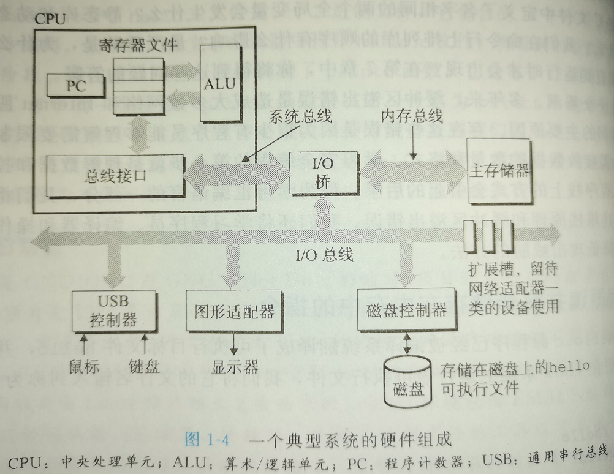
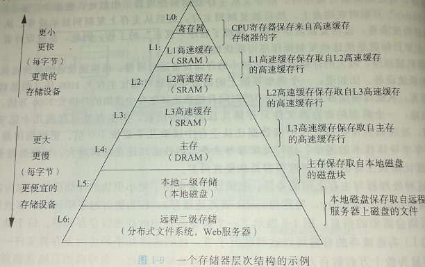
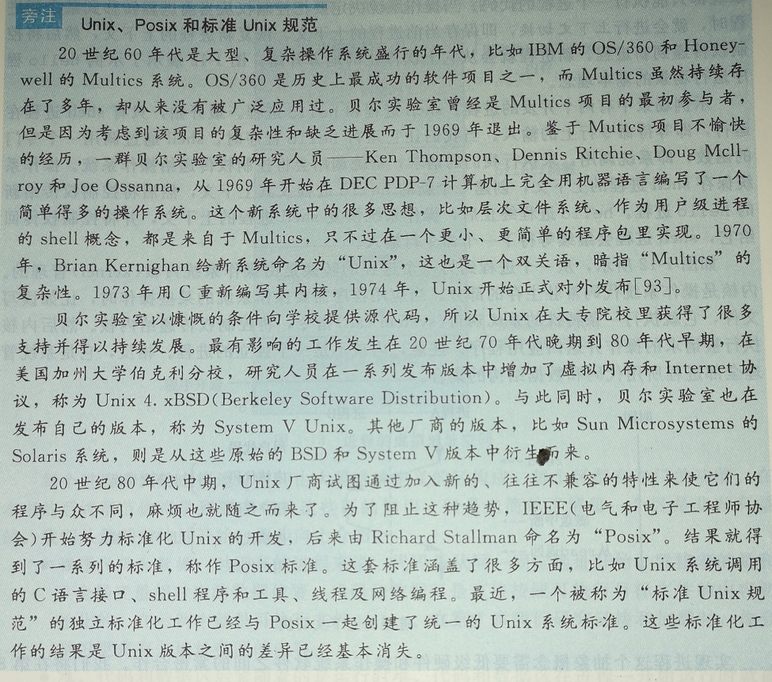
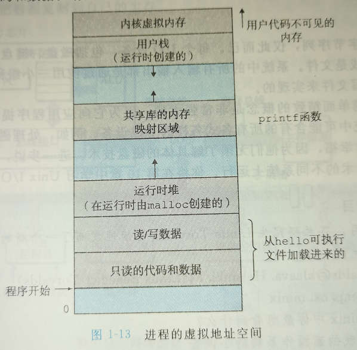
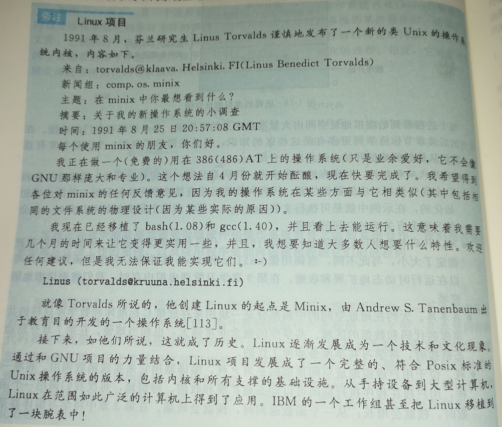
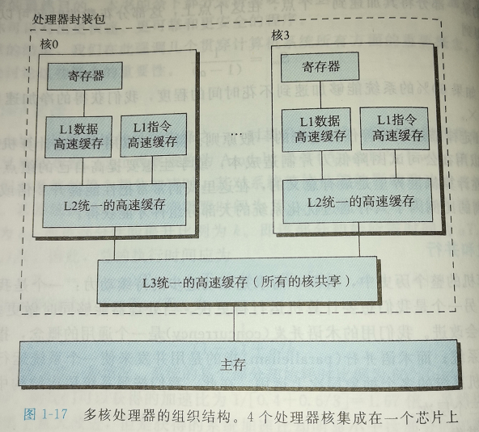
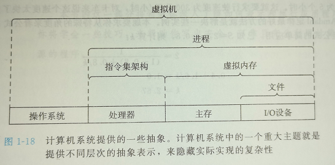

## 第1章_计算机系统漫游

[TOC]

------

### 1.1 信息就是位+上下文

系统中的所有信息包括磁盘文件、内存中的程序、各种数据，都是由一串比特表示

c语言是贝尔实验室的Dennis Ritchie 于1969年~1973年间创建的。美国国家标准学会(American National Standards Institute，ANSI)在1989年颁布 ANSI C的标准。

**C 语言与 UNIX 系统关系密切**， 因为 c 语言就是被设计用来开发 Unix 系统的。

C 语言缺少对非常有用的面向对象的**显式支持**

### 1.2 程序被其他程序翻译成不同的格式

**hello.c ---预处理器---> hello.i(导入头文件的源程序) ---编译器---> hello.s (汇编程序) ---汇编器---> hello.o(可重定位的目标程序) ---链接器---> hello/a.out(可执行程序)** 

### 1.3 了解编译系统如何工作是大有益处的

- 优化程序性能
- 理解链接时出现的错误
- 避免安全漏洞

### 1.4 处理器读并解释储存在内存中的指令

#### 系统硬件的组成

- **总线**，总线被设计成传送定长的字节快，也就是 **字长**， 一般地，32位处理器的字长为 4个字节， 64位处理器的字长位 8个字节；

- **I/O 设备**；

- **主存**，一个临时存储设备，由一组 **动态随机存取存储器芯片**组成。

  在x86-64设备上，short 类型需要2字节，int 和 float 需要4个字节，而 long 和 double 类型需要8个字节，同样的64位的地址需要 8个字节

- **处理器**， 中央处理单元，核心为一个大小为一个字的储存设备或者寄存器，称为程序计数器（PC）

  - 加载：从主存复制一个字节或一个字到寄存器，覆盖寄存器原来的内容
  - 存储：从寄存器复制一个字节或一个字到主存的某个位置
  - 操作：将两个寄存器的内容复制到ALU，ALU 对这两个字做算数运算，并将结果放到一个寄存器中，覆盖寄存器中原来的内容。
  - 跳转：从指令中抽取一个字，并将这个字复制到程序计数器中，覆盖PC 原来的值。

#### 运行hello程序

我们可以大体地认为，计算机的每一个数据块都要通过处理器的控制才得以流动。

### 1.5 高速缓存至关重要

随着半导体技术的发展，加快处理器的运行速度比加快主存的速度要容易和便宜得多。

高速缓存弥补了这种差距，这种设备称为高速缓存储存器（cache menmory， 简称为cache 或 高速缓存），位于处理器的总线接口和储存器之间。

用一种称为 **静态随机访问储存器（SRAM）**的硬件技术实现的。

### 1.6 储存设备形成层次结构

### 1.7 操作系统管理硬件

操作系统通过对硬件系统的抽象，为顶层应用程序提供服务。

通过 **进程、虚拟内存、文件**等实现：

- 防止硬件被失控的应用程序滥用
- 向应用程序提供简单已知的机制来控制复杂而且通常大不相同的低级硬件设备。

#### 进程

**进程**是对一个正在运行的程序的一种抽象。

将**并发**地执行多个进程，并实现不同进程之间的交错执行的机制称为 **上下文切换**。

#### 线程

#### 虚拟内存

**虚拟内存**是一个抽象概念，它为每个进程提供一个独占使用内存的假象。

图中地址由底至上，由低到高

由最底向上有：

- **程序代码和数据**，在程序开始运行时就被指定了大小；
- **堆**，动态调整大小，当调用malloc和free等函数时被调整；
- **共享库**， 像 printf 这样的共享库函数被存放在这里；
- **栈**， 动态调整大小，调用函数时，栈就会增长，函数返回时，栈就会收缩
- **内核虚拟内存**， 程序不可见内存

#### 文件

**文件就是字节序列**

**所有的 I/O 设备都可以看成文件。**系统中的所有输入输出都是通过一小组 称为UNIX I/O 的系统函数调用文件读写实现的

#### Linux项目

### 1.8 系统之间利用网络通信

### 1.9 重要主题

#### Amdahl 定律

α为某部分的执行时间比例，k为性能提升比例

则总新性能S为
$$
S = \frac{1}{\left ( 1 - \alpha  \right) + \alpha / k}
$$
也就是说，如果α不够大，k的提升也是徒劳的

这也意味着当k无穷大时，S的极限为1 / (1 - α)

#### 并发和并行

并发可以抽象为横向（更多），并行则为前进的纵向（更快）

- **线程级并发**

  - 一个处理器上的多任务切换，可以称为 **单处理系统**
  - 多处理系统，也称多核

- **指令级并发**

  如果处理器可以达到比一个始终周期一条指令更快的执行速率，就称之为 **超标量（superscalar）处理器**

- **单指令、多数据并行**    

  - 允许一条指令产生多个可以并行的操作，这种方式成为单指令、多数据，即 **SIMD 并行**

  - 多为了提高处理影像、声音和视频数据应用的执行速度。

  - 有些编译器会试图从C程序中自动抽取SIMD并行性，但是更可靠的方法是用编译器支持的特殊的向量数据类型来写数据

#### 计算机系统中抽象的重要性

**抽象**的使用是计算机科学中最为重要的概念之一。

每一层都是对低一级层的抽象描述。所以进程并不需要关系输入输出流是由什么I/O设备提供的，类似地，虚拟机也不需要知道进程执行的内部细节，只需关心合理调度以实现更多更快的目标

