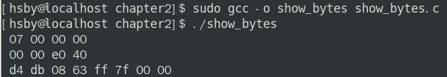

## 第2章_信息的表示和处理

[TOC]

------


### 2.1 信息的储存

大多数计算机使用**8位的块**，即**字节**，作为最小的可寻址的单位


机器级语言将内存视为一个非常大的数组，称为 **虚拟内存**


C语言将指针，一个指向一个字节块首位的地址，和类型信息联系起来，生成不同的机器级代码来访问储存的值。


#### 字数据大小

**字长指明指针数据的标称大小**，决定字长的最重要系统参数是虚拟内存空间的最大大小。


32位字长限制虚拟内存空间为4GB，即 ~2^32 * 1 Byte；


64位字长限制虚拟内存为16EB， 即 ~1.84 * 10^19 Byte;


#### 寻址和字节顺序

**大端法**， 最高有效字节在前

**小端法**， 最高有效字节在后


相同点是最小单位都还是字节。


大多数Intel 兼容机都只用小端法，IBM 和 Oracle 制造的大多数机器则是按大端法模式操作。


**实际情况是，一旦选择了特定的操作系统，字节顺序就被固定下来**


ARM微处理器（大多数手机的处理器），可以按两种端法模式操作，但是其主要操作系统 **Andriod 和 iOS 只能运行于小端法模式**


  

```c
#include<stdio.h>

typedef unsigned char *byte_pointer;

void show_bytes(byte_pointer start, size_t len){
	
	size_t i;
	for(i = 0; i < len; i++)
		printf(" %.2x", start[i]);//将传入指针按字节读出
	printf("\n");
	
}

void show_int(int x){
	show_bytes((byte_pointer) &x, sizeof(int));
}

void show_float(float x){
	show_bytes((byte_pointer) &x, sizeof(float));
}

void show_pointer(void *x){
	show_bytes((byte_pointer) &x, sizeof(void*));
}

int main(){
	
  	int a = 10;
	void* x = &a;
	show_int(7);
	show_float(7.0f);
	show_pointer(x);

    return 0；
}
```

linux_x86_64输出：




书中

```c
void test_show_bytes(int val){
    int ival = val;
    float fval = (float) val;
    float pval = (void *) val;
    show_int(ival);
	show_float(fval);
	show_pointer(pval);
}
```

输出:


**值得注意的是，实例中的linux64用的是8byte指针**


#### 表示字符串


Unicode 使用32位来表示字符，也就是4个字节，


#### 用位向量表示一个集合

例如 [01010101]可以用来表示集合{0, 2, 4, 6}


#### c 的位运算

a^a=0


若c = a^b

则a = b^c, b = a ^ c;


#### c 的位移位运算

在c语言中，位移运算符优先级低于+-运算符


**几乎所有编译器对有符号数使用算术右移，另一方面，对无符号数，右移操作必须是逻辑右移**


c语言很小心地规避了当**位移量大于待位移值的位数时**的尴尬结果，即**实际位移量是k mod w** 得到的，也就是当一个数val的位数为32时，val >> 32 实际是 val >> (32 mod 32 = 0)

不过这种行为对于c程序来说是没有保证的，所以应该保持唯一量小于待位移值的位数


------


### 2.2 整数表示


#### 整型数据类型


我们注意到long的大小由32位程序的4个字节变成64位的8个字节


#### 补码编码

定义


**补码 即 位向量的最高位表示负权，若一个w位的补码位向量的最高位为1， 则 最高位的值为 -2^(w-1)**


故补码位向量的最小值应该为 [10000...]，将负权位设置为1，其余位设置为0

而最大值为[01111....]，将负权位设置为0， 其余位设置为1


**ISO C99标准**在库文件 stdint.h 中引入了整型类型类，诸如 intN_t、uintN_t 等数据类型明确规定了一个变量的大小范围，而且每一个类型都对应着一个宏，对应每一个类型的最大值，最小值


**格式化**

在32位程序中

```c
int32_t x;
int64_t y;
printf("x = %" PRId ", y = %" PRIu "\n", x, y);
```

在64位程序中，源代码不改变，PRId被编译器展开为 d, 而PRIu被展开为lu;

```c
int32_t x;
int64_t y;
printf("x = %d, y = %lu\n", x, y);
```

这保证了无论代码被如何编译，都会形成正确的字符串格式


#### 有符号数和无符号数之间的转换

同一位模式下不同编码模式的值

| 位模式 | 无符号 | 补码 | 反码 | 原码 |
| ------ | ------ | ---- | ---- | ---- |
| 0000   | 0      | 0    | 0    | 0    |
| 0001   | 1      | 1    | 1    | 1    |
| 0010   | 2      | 2    | 2    | 2    |
| 0011   | 3      | 3    | 3    | 3    |
| 0100   | 4      | 4    | 4    | 4    |
| 0101   | 5      | 5    | 5    | 5    |
| 0110   | 6      | 6    | 6    | 6    |
| 0111   | 7      | 7    | 7    | 7    |
| 1000   | 8      | -8   | -7   | 0    |
| 1001   | 9      | -7   | -6   | -1   |
| 1010   | 10     | -6   | -5   | -2   |
| 1011   | 11     | -5   | -4   | -3   |
| 1100   | 12     | -4   | -3   | -4   |
| 1101   | 13     | -3   | -2   | -5   |
| 1110   | 14     | -2   | -1   | -6   |
| 1111   | 15     | -1   | 0    | -7   |


我们很容易看出，

当无符号数小于2^(w-1)时，对应的补码表示的数跟它一样；

当无符号数大于等于2^(w - 1)时, 对应的补码表示的值为 (2^w - 无符号数的值)。


#### c 语言中的有符号数和无符号数

c标准并没有规定两种转换之间应该使用何种编码模式，但是大多数系统遵循的原则是保持位模式不变。


```c
#include <stdio.h>


int main(){
  
  int x = -1;
  unsigned u = 2147483648;

  printf("sizeof(int) = %d \n", sizeof(x));
  printf("sizeof(unsigned) = %d \n", sizeof(unsigned));

  printf("x = %u = %d\n", x, x);
  printf("u = %u = %d\n", u, u);

  return 0;
}

```


**当一个无符号数和一个有符号数执行运算时，C 语言默认将有符号数强制转换为无符号数，当然，位模式保持不变**


#### 扩展一个数字的位表示

在c语言中，

**扩展有符号数使用1补齐高位**

**扩展无符号数使用0补齐高位**


有符号数一般使用补码表示，而在补码中有

[101] 补码表示为-3

[1101] 补码表示为-3

这种神奇的扩展来源于，原来为 -4 +1 = -3

扩展后，-8 - 4  + 1 = -3, 原因是 x^(w) - x ^ (w - 1) = x^(w - 1)，所以实例中原来[101]的负权位为-4 = 后来的负权位 - 原来的负权位，根据归纳法，我们可以在不影响补码表示值的情况下，用高位补1重复扩展这个值的宽度。


**在转换不同大小的有无符号的两个值时，应该先转换大小，再转换有无符号。** 


#### 截断数字


将一个值为x1的w位模式截断成值为x2的k位模式，其中w>k, 有x2 = x1 mod 2^k.

大于k的位的权重是x^k整数倍。


------


### 2.3 整数运算


#### 无符号加法


0 <= x,y < 2^w, 

s = x + y;

若 s < x;则溢出，反之亦然；


```c
int uadd_ok(unsigned int x, unsigned int y){
  return x <= x - y;
}
```


#### 补码加法


```c
int tadd_ok(int x, int y){
 return !(x >= 0 && y >= 0 && x + y < 0) && !(x < 0 && y < 0 && x + y <= 0);
}
```


#### 补码乘法


验证是否溢出

```c
int tmult_ok(int x, int y){
    int p = x * y;
    return !x || p/x == y; //巧妙地避开了x = 0
}
```


#### 乘以常数

可以使用左位移等价于乘以2的幂，[1011] = 11，[1011] << 2 = [101100] = 44


> 像 x * 14可以理解为
>
> 14 = 2^4 - 2^1;
>
> 14 = [1110] = [10000] - [10];
>
> 通过记录一组连续的1的首尾位置，例子中，首位置n = 3, 尾位置m = 1;
>
> 这样一组连续的1表示的值就可以转换为 2^(n+1) - 2^m;
>
> 比如 [111] = 7，那么n = 2, m = 0;
>
> 则[111] = 7 = [1000] - 1 = 2 ^ (2 + 1) - 2 ^ 0;
>
> 进而 x << 14 = x << (16 - 2) = (x << 16 ) - (x << 2);


#### 除以2的幂


**向下舍入**


**补码小于零向上舍入**

对小于零的补码数值采用向上舍入，以达到向零舍入的效果

（x < 0 ? x + ( 1 << k )  : x   >> k）

加上位移量使得当x整除时，得到整除数，当k不整除时，得到一个向上舍入的数。


------


#### 二进制小数

#### 浮点数


**单精度浮点数**：32位，由 1 个标志位s，8 个阶码位，23个尾数位构成

**双精度浮点数**：64位，由 1 个标志位s，12 个阶码位，51个尾数位构成


**规格化的值**

阶码位不全是0或1时，

单精度阶码位表示 E = e - Bias(127), 范围在-126 到 127之间

双精度阶码位表示 E = e - Bias(1023), 范围在- 1022 到 1023之间

尾数位被描述为小数， M = 1 + f，即1.xxx;


**非规格化值**

阶码位全0时，

解码值为 E = 1 - Bias;

尾数的值 M = f;


**特殊值**

当阶码位全1时

表示极大值和极小值，此时小数值也全零。

如果小数值不为0，则表示NaN，不是一个数字的意思。


#### 数字表示


**不同大小的阶数段对应了同样数量的小数段，所以当阶数了小数都很小的时候，浮点数的分布越密集。**


#### 舍入

向偶数舍入保证了在舍入的时候不会偏向哪一方，消除了总是偏向上或者向下的这种偏差


**先考虑最接近的两个舍入值，若被处理值在两个可能的舍入值中间，则考虑尽量向偶舍入。**


#### 浮点运算


浮点运算不满足加法的结合律 a + b + c ！= a + (b + c)。同时乘法结合律也不满足：a * b * c != a * (b * c)；还要分配律也不满足： a * (b + c) != a * b + a * c


但是浮点数运算具有保持单调性，故 

对任意浮点数除了NaN，若a >= b, 有x + a >= x + b;

a * a > = 0;


**int 的精度大于 float**


