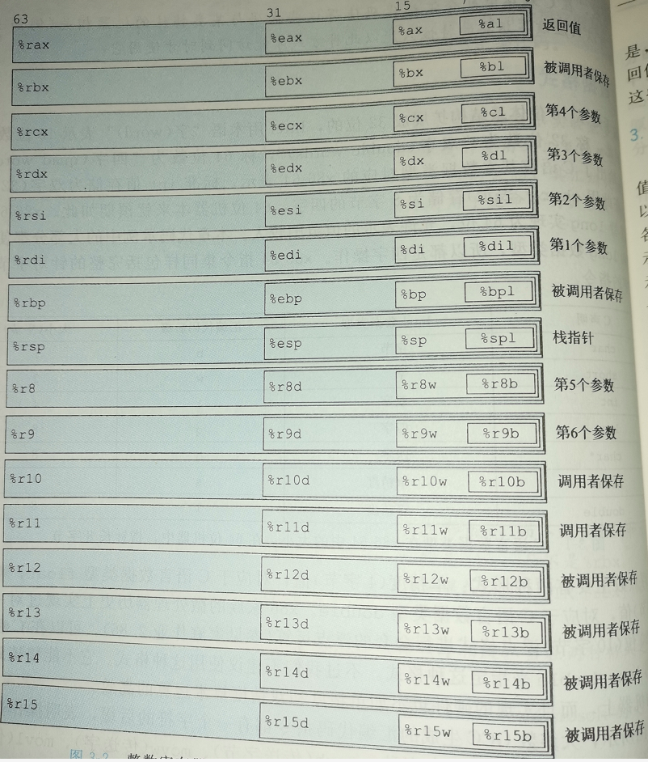
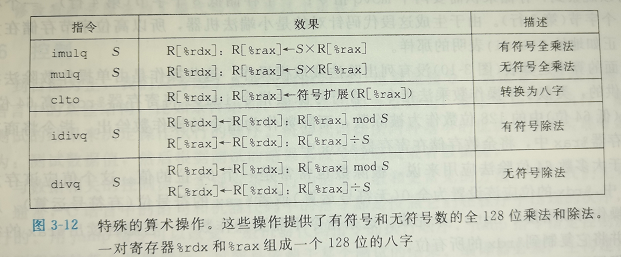
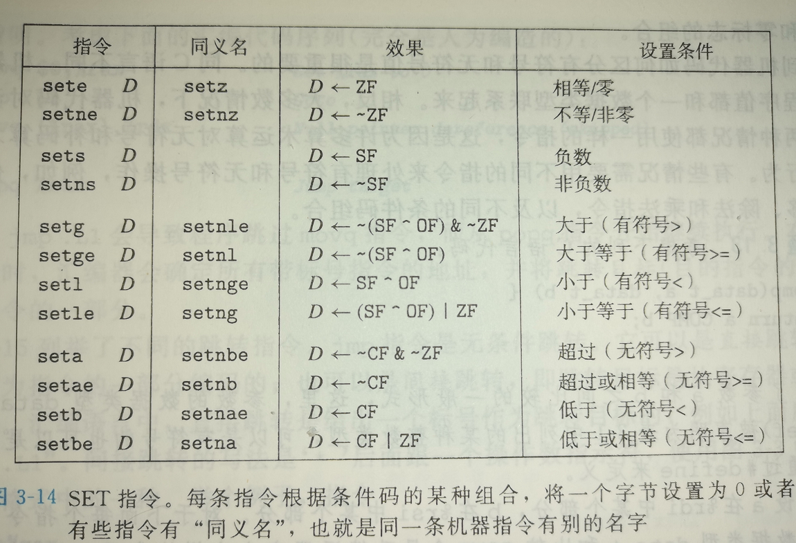
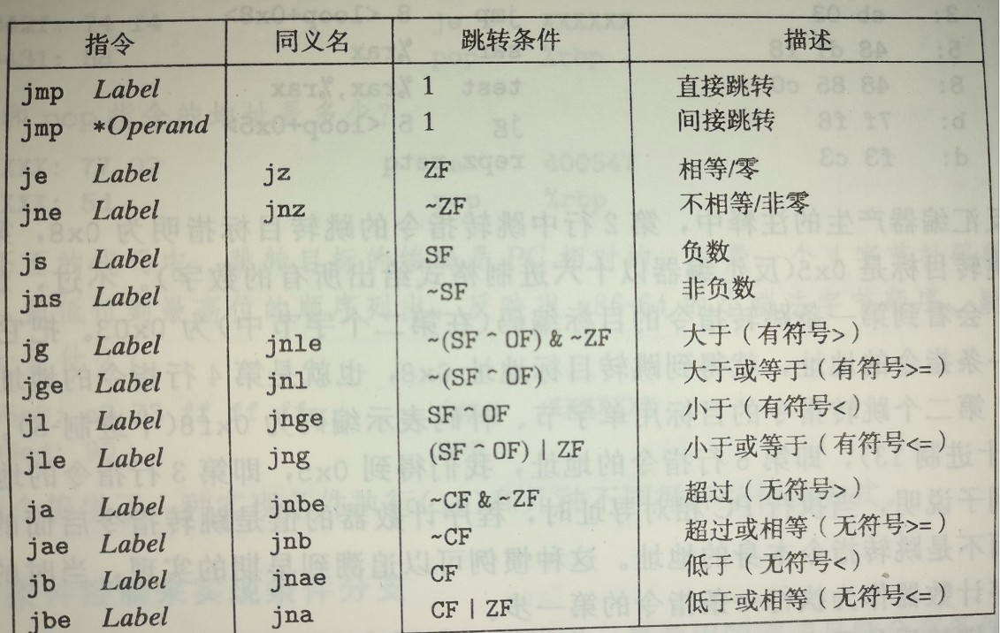
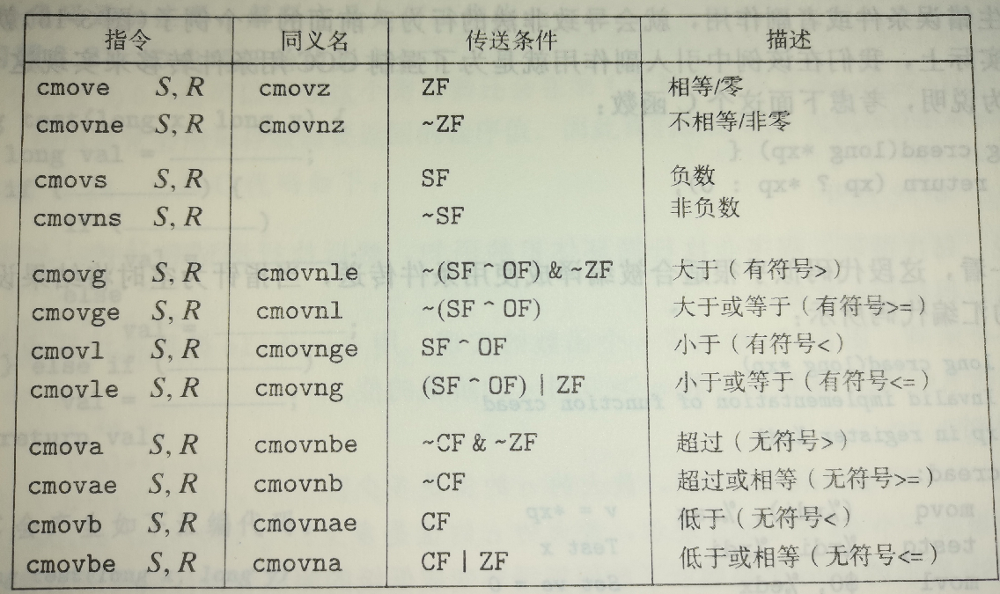
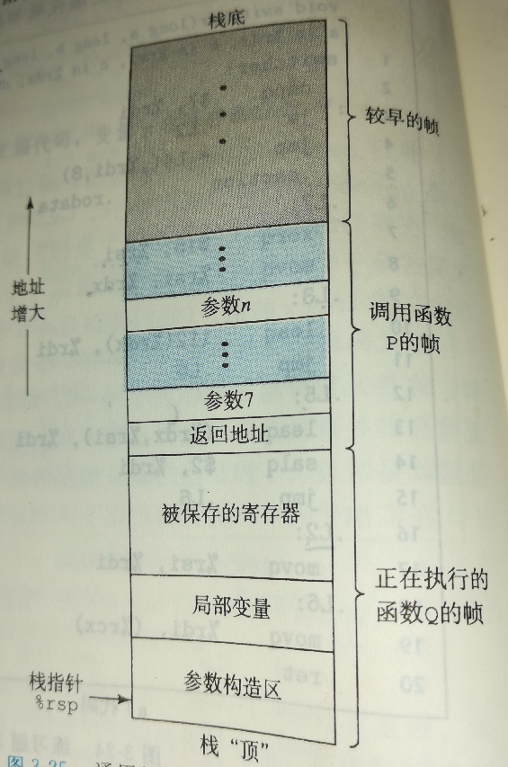
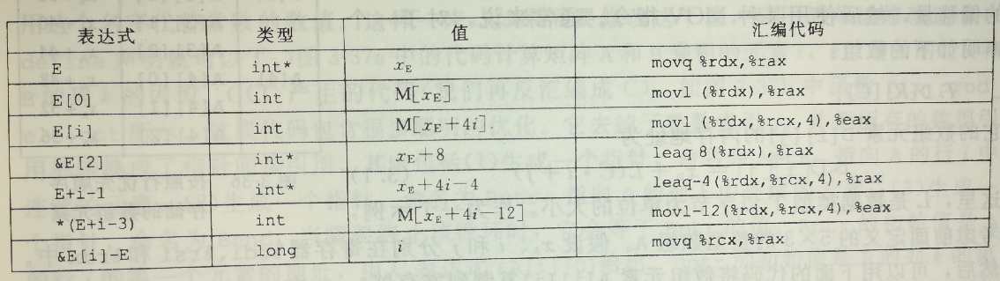
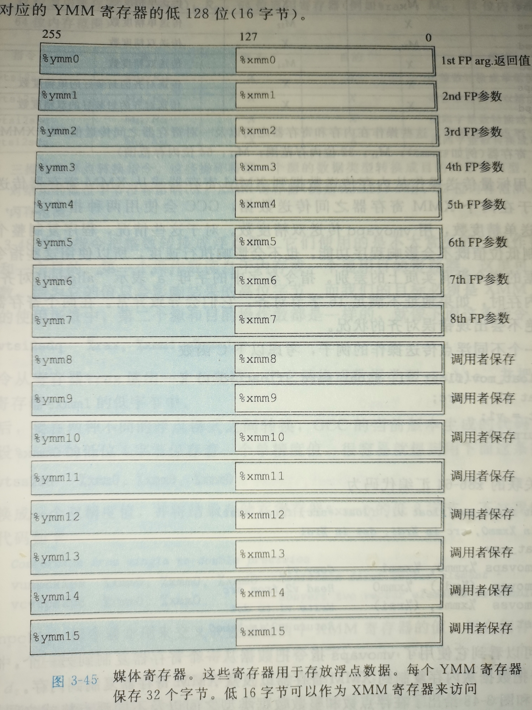
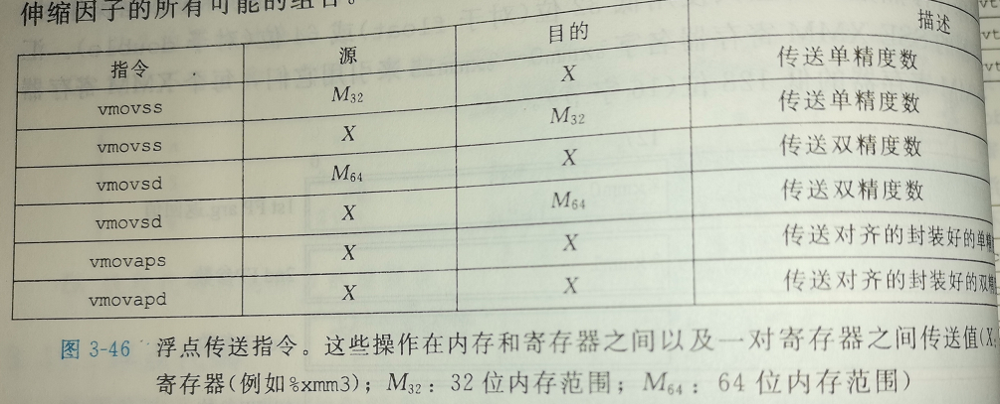
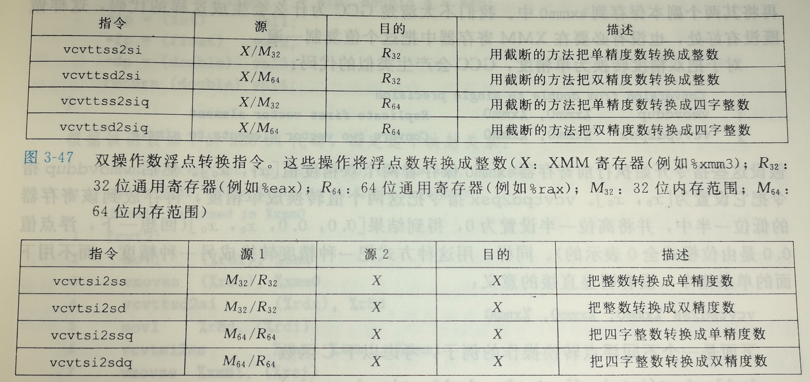

## 第3章_程序的机器级表示


[TOC]

------


### 3.1 历史观点

Intel处理器俗称 x86；


i386是英特尔系列中第一台全面支持Unix系统的机器


Pentium3，加入了sse, 处理整数或浮点数向量的指令


Pentium4,sse 升级为sse2, 增加了包括双精度浮点数等数据类型

 

------


### 3.2 程序编码

gcc


####  机器级代码


两种重要抽象：

- 指令集体系结构或指令集架构 (Instruction Set Architecture, ISA)
- 机器级程序提供的内存是虚拟内存，就像一个很大的数组


x86_64 机器语言中，某些对C语言程序员隐藏的处理器状态都是可见的：

- 程序计数器，保存着程序下一条将要执行的指令的地址
- 整数寄存器文件，包含16个命名的位置，分别储存64位的值
- 条件码寄存器保存着最近执行的算术或逻辑指令的状态信息
- 一组向量寄存器可以存放一个或多个整数或浮点数

操作系统负责将虚拟内存翻译成处理器实际的物理地址


一些反汇编表示的特性：

- x86_64 的指令长度从1 到 15个字节不等
- 从某个位置开始，可以将字节唯一地解码为某个指令


汇编程序中函数常常会多出一些占用一个字节的nop指令，补位作用，整16的字节数使得存储器更好地放置代码块。


AT&T 和 Intel 汇编代码风格

- AT&T 是gcc 和 objdump 这些我们常用工具的默认风格
- 其他的工具，包括Microsoft 的工具，来自英特尔的文档，汇编代码风格都是Intel风格
- 不同点：
  - Intel代码省略了只是大小的后缀。
  - Intel代码省略了寄存器名字前面的 %符号。
  - Intel代码用不同的方式来面熟内存中的位置，例如是'QWORD PTR [rbx] ' 而不是 ' (%rbx) '


------


### 3.3 数据格式


由于是从16位的体系结构扩展成32位和64位的，Intel 用术语把 "字 (word)" 表示为16为数据类型，把32位数据类型称为 "双字(double word)"， 64位则称为 "四字(quad words)"





### 3.4 数据传送指令


x86_64 规定两个操作数不能同时指向内存位置


x86_64 有个惯例，任何为寄存器生成32位值的指令都会把寄存器高位部分设置为0


地址传参并提取指向的值，相当于汇编中的间接寻址。


栈的压入和弹出单位是8字节


------


### 3.5 算术和逻辑操作


#### 加载有效地址

c源码：

```c
long scale(long x, long y, long z){
    long t = x + 4 * y + 12 * z;
    return t;
}
```

翻译成：

```asm
scale:
	leap (%rdi, %rsi, 4), %rax 
	leap (%rdx, %rdx, 2), %rdx
	leap (%rax, %rdx, 4), %rax
	ret
```


#### 一元和二元操作


#### 唯一操作


位移量可以是立即数，也可以是放在单字节寄存器 %cl 中


在x86_64中，对w位长的数据值进行唯一操作，位移量是由 %cl 寄存器的低m位决定的，有 2^m = w，**相当于对低m位模式取模**。


#### 特殊的算数操作


**全乘法**




将%rax 作为一个参数，另一个参数由源操作数给出，将结果地位放在 %rax, 高位放在 %rdx


**除法**


被除数放置在 %rax , 无符号运算将 %rdx 设置为 全0，有符号运算将 %rdx 设置为全符号位，


### 3.6 控制


#### 条件码


- CF, 进位标志
- ZF， 零标志
- SF， 符号标志
- OF， 溢出标志。


除了leap指令，其他指令都会设置标志位


#### 访问条件码





```c
int comp (int a, int b){
    return a < b;
}

int compu(unsigned a, unsigned b){
    return a < b;
}
```

反汇编

```asm
0000000000000000 <comp>:
   0:	39 f7                	cmp    %esi,%edi	;比较 cmp b, a
   2:	0f 9c c0             	setl   %al			;有符号提取结果，结果为一个字节表示的0 或者 1
   5:	0f b6 c0             	movzbl %al,%eax		;将结果放到返回值寄存器并转化为64个字节表示
   8:	c3                   	retq   

0000000000000009 <compu>:
   9:	39 f7                	cmp    %esi,%edi
   b:	0f 92 c0             	setb   %al
   e:	0f b6 c0             	movzbl %al,%eax
  11:	c3                   	retq   
```


**set**指令通过整合溢出标志位和符号标志位，保证了comp指令运算溢出时，也能得到正确的结果；

comp(a, b), a和b都是有符号数据，

当a比b大且cmp发生了正溢出，即a -  b > 2 ^ 64 - 1;汇编指令执行cmp b, a, 此时OF = 1， SF = 1, 但是当**setl**提取小于符号时，能正确读出SF ^ OF = 0， 即 a < b = 0;

因为有符号运算溢出时，符号会改变, 而 ^ OF 正是将被改变的符号位矫正。

当a， b 相等时，cmp有符号运算并不会改变符号位。


无符号的小于判断更是直接的利用这一原理，当发生溢出时，a - b < 0;此时溢出，CF = 1;故a < b = CF;


#### 跳转指令





将上一条设置标志位的指令作为跳转的条件，跳转指令的操作数可以是存放在寄存器的值，也可以是存放在内存的地址值， 也可以是标号。


#### 跳转指令的编码


跳转命令的操作数为补码编码，意义就是 跳转到下一条命令的地址+操作数地址的地址。


链接后，跳转命令的操作数变成了绝对地址。


```c

long lt_cnt = 0;
long ge_cnt = 0;

long absdiff_se(long x, long y){;
   long res ;
   if(x < y){
       lt_cnt++;
       res = y - x;
   }
   else{
       ge_cnt++;
       res = x - y;
   }
   return res;
}

long gotodiff_se(long x, long y){

    long res;
    if(x >= y) goto x_ge_y;
    lt_cnt++;
    res = y - x;
    return res;
    
x_ge_y:
    ge_cnt++;
    res = x - y;
    return res;
}

```

反汇编：

```asm
absdiff_se.o：     文件格式 elf64-x86-64

Disassembly of section .text:

0000000000000000 <absdiff_se>:
   0:	48 39 f7             	cmp    %rsi,%rdi
   3:	7d 0f                	jge    14 <absdiff_se+0x14>
   5:	48 83 05 00 00 00 00 	addq   $0x1,0x0(%rip)        # d <absdiff_se+0xd>
   c:	01 
   d:	48 89 f0             	mov    %rsi,%rax
  10:	48 29 f8             	sub    %rdi,%rax
  13:	c3                   	retq   
  14:	48 83 05 00 00 00 00 	addq   $0x1,0x0(%rip)        # 1c <absdiff_se+0x1c>
  1b:	01 
  1c:	48 89 f8             	mov    %rdi,%rax
  1f:	48 29 f0             	sub    %rsi,%rax
  22:	c3                   	retq   

0000000000000023 <gotodiff_se>:
  23:	48 39 f7             	cmp    %rsi,%rdi
  26:	7d 0f                	jge    37 <gotodiff_se+0x14>
  28:	48 83 05 00 00 00 00 	addq   $0x1,0x0(%rip)        # 30 <gotodiff_se+0xd>
  2f:	01 
  30:	48 89 f0             	mov    %rsi,%rax
  33:	48 29 f8             	sub    %rdi,%rax
  36:	c3                   	retq   
  37:	48 83 05 00 00 00 00 	addq   $0x1,0x0(%rip)        # 3f <gotodiff_se+0x1c>
  3e:	01 
  3f:	48 89 f8             	mov    %rdi,%rax
  42:	48 29 f0             	sub    %rsi,%rax
  45:	c3                   	retq   
```


```c
void cond(long a, long *p){
    if(p && a > *p) *p = a;
}
```


```asm
cond:
	testq	%rsi, %rsi
	je		.L1		;也就是&&连接两个逻辑运算如果第一个值为假，直接跳转
	cmpq	%rdi, (%rsi)
	jge 	.L1
	movq 	%rdi, (%rsi)
.L1:
	rep; ret
```


#### 用条件传送来实现分支


cmovge 当条件满足时，执行赋值


x86_64处理器为了保证性能，会预测条件跳转指令中操作的执行概率，大部分情况下，这种猜测带来的性能提升是可观的：

因为操作的指令也同条件一起被读进来了，所以当处理器猜测操作概率是可行时，在条件判断开始的同时，处理器也开始操作的预备工作，这样就能保证指令流水线连续不间断执行。





实现条件传送会在分支判断之前，执行两个可能的表达式。

```c
int res = a - b;
int tmp = b - a;
if (b > a) res = tmp;
return res;
```


所以当判断条件是指针是否为空时，不能使用条件传送。


#### 循环


```c
long dw_loop(long x){

    long y = x * x;
    long *p = &x;
    long n = 2 * x;

    do{

        x += y;
        (*p)++;
        n--;

    }while( n > 0 );

    return x;

}
```

`gcc - Og -c `,反编译：

```asm
obj/dw_loop.o：     文件格式 elf64-x86-64


Disassembly of section .text:

0000000000000000 <dw_loop>:
   0:	48 89 f8             	mov    %rdi,%rax
   3:	48 89 f9             	mov    %rdi,%rcx
   6:	48 0f af cf          	imul   %rdi,%rcx
   a:	48 8d 14 3f          	lea    (%rdi,%rdi,1),%rdx
   e:	48 8d 44 01 01       	lea    0x1(%rcx,%rax,1),%rax
  13:	48 83 ea 01          	sub    $0x1,%rdx
  17:	48 85 d2             	test   %rdx,%rdx
  1a:	7f f2                	jg     e <dw_loop+0xe>
  1c:	f3 c3                	repz retq 
```


while循环的两种翻译方法

- jump to middle方法，在第一次进入循环之前，直接跳转到位于循环体后的判断语句块
- guarded-do方法，在第一次进入循环之前，先执行判断，如果不符合，直接跳过循环语句块，如果符合，执行第一次循环体，循环语句块最后接着判断语句


源码：

```c
long fact_while( long n ){
   
    long result = 1;
    while ( n > 1 ){
        result *= n;
        n++;
    }
    return result;                                                         
}
```


gcc -Og,  反编译：

```asm
obj/fact_while.o：     文件格式 elf64-x86-64


Disassembly of section .text:

0000000000000000 <fact_while>:
   0:	b8 01 00 00 00       	mov    $0x1,%eax
   5:	eb 08                	jmp    f <fact_while+0xf>
   7:	48 0f af c7          	imul   %rdi,%rax
   b:	48 83 c7 01          	add    $0x1,%rdi
   f:	48 83 ff 01          	cmp    $0x1,%rdi
  13:	7f f2                	jg     7 <fact_while+0x7>
  15:	f3 c3                	repz retq 
```

这是先跳转到循环判断语句，开始执行循环。


gcc -O1，反编译：

```asm
obj/fact_while.o：     文件格式 elf64-x86-64


Disassembly of section .text:

0000000000000000 <fact_while>:
   0:	48 83 ff 01          	cmp    $0x1,%rdi
   4:	7e 15                	jle    1b <fact_while+0x1b>;如果不符合大于，跳转到循环体结束位置
   6:	b8 01 00 00 00       	mov    $0x1,%eax
   b:	48 0f af c7          	imul   %rdi,%rax
   f:	48 83 c7 01          	add    $0x1,%rdi
  13:	48 83 ff 01          	cmp    $0x1,%rdi
  17:	7f f2                	jg     b <fact_while+0xb>
  19:	f3 c3                	repz retq 
  1b:	b8 01 00 00 00       	mov    $0x1,%eax
  20:	c3                   	retq   
```

很明显这是guarded-do 策略。


#### switch 语句

使用一个称为 *跳转表 ( jump table )* 的数组进行跳转


```c
void switch_eg_impl( long x, long n, long *dest ){

    long val = x;
    switch ( n ){

        case 100:
            val *= 13; break;
        
        case 102:
            val += 10;

        case 103:
            val += 11; break;

        case 104:

        case 106:
            val *= val; break;

        default: 
            val = 0;

    }

    *dest = val;

}
```


反编译：

```asm
obj/switch_eg_impl.o：     文件格式 elf64-x86-64


Disassembly of section .text:

0000000000000000 <switch_eg_impl>:
   0:	48 83 ee 64          	sub    $0x64,%rsi
   4:	48 83 fe 06          	cmp    $0x6,%rsi
   8:	77 21                	ja     2b <switch_eg_impl+0x2b>
   a:	ff 24 f5 00 00 00 00 	jmpq   *0x0(,%rsi,8)
  11:	48 8d 04 7f          	lea    (%rdi,%rdi,2),%rax
  15:	48 8d 3c 87          	lea    (%rdi,%rax,4),%rdi
  19:	eb 15                	jmp    30 <switch_eg_impl+0x30>
  1b:	48 83 c7 0a          	add    $0xa,%rdi
  1f:	48 83 c7 0b          	add    $0xb,%rdi
  23:	eb 0b                	jmp    30 <switch_eg_impl+0x30>
  25:	48 0f af ff          	imul   %rdi,%rdi
  29:	eb 05                	jmp    30 <switch_eg_impl+0x30>
  2b:	bf 00 00 00 00       	mov    $0x0,%edi
  30:	48 89 3a             	mov    %rdi,(%rdx)
  33:	c3                   	retq   
```


将跳转值映射为跳转表的索引，通过跳转值索引取得跳转表上的地址。


------


### 3.7 过程


过程的形式：

- 函数(function)
- 方法(method)
- 子例程(subroutine)
- 处理函数(hundler)
- 等等


#### 运行时栈


只有6个寄存器可以拿来传递整型参数，如果需要更多参数，调用前，调用者必须将参数压入自己的栈帧，以及调用指令的下一条指令的地址


#### 转移控制


call 将下一条指令的地址压入栈中，retq将栈顶元素弹出并设置为程序计数器的值


#### 数据传送





```c
void proc(  long    a1, long*   a1p,
            int     a2, int*    a2p,
            short   a3, short*  a3p,
            char    a4, char*   a4p
        ){
    *a1p += a1;
    *a2p += a2;
    *a3p += a3;
    *a4p += a4;
}
```

gcc -Og 反汇编：

```asm
obj/proc.o：     文件格式 elf64-x86-64

Disassembly of section .text:

0000000000000000 <proc>:
   0:	48 8b 44 24 10       	mov    0x10(%rsp),%rax
   5:	48 01 3e             	add    %rdi,(%rsi)
   8:	01 11                	add    %edx,(%rcx)
   a:	66 45 01 01          	add    %r8w,(%r9)
   e:	8b 54 24 08          	mov    0x8(%rsp),%edx
  12:	00 10                	add    %dl,(%rax)
  14:	c3                   	retq   
```


#### 栈上的局部储存

```c
long swap_add( long *xp, long *yp ){

   long x = *xp;
   long y = *yp;
   *xp = y;
   *yp = x;
   return x + y;
    
}

long caller(){

    long arg1 = 534;
    long arg2 = 1057;
    long sum = swap_add( &arg1, &arg2 );
    long diff = arg1 - arg2;
    return diff * sum;
}

```

gcc -Og 反汇编:

```asm
obj/caller.o：     文件格式 elf64-x86-64


Disassembly of section .text:

0000000000000000 <swap_add>:
   0:	48 8b 17             	mov    (%rdi),%rdx
   3:	48 8b 06             	mov    (%rsi),%rax
   6:	48 89 07             	mov    %rax,(%rdi)
   9:	48 89 16             	mov    %rdx,(%rsi)
   c:	48 01 d0             	add    %rdx,%rax
   f:	c3                   	retq   

0000000000000010 <caller>:
  10:	48 83 ec 10          	sub    $0x10,%rsp;将栈顶向低地址移动
  14:	48 c7 44 24 08 16 02 	movq   $0x216,0x8(%rsp);在栈中保存局部变量
  1b:	00 00 
  1d:	48 c7 04 24 21 04 00 	movq   $0x421,(%rsp)
  24:	00 
  25:	48 89 e6             	mov    %rsp,%rsi;用寄存器保存局部变量在栈中的地址
  28:	48 8d 7c 24 08       	lea    0x8(%rsp),%rdi
  2d:	e8 00 00 00 00       	callq  32 <caller+0x22>
  32:	48 8b 54 24 08       	mov    0x8(%rsp),%rdx
  37:	48 2b 14 24          	sub    (%rsp),%rdx
  3b:	48 0f af c2          	imul   %rdx,%rax
  3f:	48 83 c4 10          	add    $0x10,%rsp;在函数返回之前，将栈顶指针指向被调用时的栈顶
  43:	c3                   	retq   
```


```c
void proc(  long    a1, long*   a1p,
            int     a2, int*    a2p,
            short   a3, short*  a3p,
            char    a4, char*   a4p
        ){
    *a1p += a1;
    *a2p += a2;
    *a3p += a3;
    *a4p += a4;
}

long call_proc(){

    long    x1 = 1;
    int     x2 = 2;
    short   x3 = 3;
    char    x4 = 4;
    proc( x1, &x1, x2, &x2, x3, &x3, x4, &x4 );
    return ( x1 + x3 ) * ( x3 - x4 );

}
```

gcc -Og 反汇编：

```asm
obj/proc.o：     文件格式 elf64-x86-64


Disassembly of section .text:

0000000000000000 <proc>:
   0:	48 8b 44 24 10       	mov    0x10(%rsp),%rax
   5:	48 01 3e             	add    %rdi,(%rsi)
   8:	01 11                	add    %edx,(%rcx)
   a:	66 45 01 01          	add    %r8w,(%r9)
   e:	8b 54 24 08          	mov    0x8(%rsp),%edx
  12:	00 10                	add    %dl,(%rax)
  14:	c3                   	retq   

0000000000000015 <call_proc>:
  15:	48 83 ec 20          	sub    $0x20,%rsp;总共需要32个字节保存局部变量和形式参数
  19:	48 c7 44 24 18 01 00 	movq   $0x1,0x18(%rsp);x1
  20:	00 00 
  22:	c7 44 24 14 02 00 00 	movl   $0x2,0x14(%rsp);x2
  29:	00 
  2a:	66 c7 44 24 12 03 00 	movw   $0x3,0x12(%rsp);x3
  31:	c6 44 24 11 04       	movb   $0x4,0x11(%rsp);x4
  36:	48 8d 44 24 11       	lea    0x11(%rsp),%rax;
  3b:	48 89 44 24 08       	mov    %rax,0x8(%rsp);将x4的地址放在栈顶后8个地址处，作为参数8
  40:	c7 04 24 04 00 00 00 	movl   $0x4,(%rsp);将x4放在在栈顶，作为参数7
  47:	4c 8d 4c 24 12       	lea    0x12(%rsp),%r9;x3的地址，参数6
  4c:	41 b8 03 00 00 00    	mov    $0x3,%r8d;x3的值，参数5
  52:	48 8d 4c 24 14       	lea    0x14(%rsp),%rcx;x2的地址，参数4
  57:	ba 02 00 00 00       	mov    $0x2,%edx;x2的值，参数3
  5c:	48 8d 74 24 18       	lea    0x18(%rsp),%rsi;x1的地址，参数2
  61:	bf 01 00 00 00       	mov    $0x1,%edi;x1的值，参数1
  66:	e8 00 00 00 00       	callq  6b <call_proc+0x56>
  6b:	0f b7 54 24 12       	movzwl 0x12(%rsp),%edx
  70:	48 0f bf c2          	movswq %dx,%rax
  74:	48 03 44 24 18       	add    0x18(%rsp),%rax
  79:	0f bf d2             	movswl %dx,%edx
  7c:	0f be 4c 24 11       	movsbl 0x11(%rsp),%ecx
  81:	29 ca                	sub    %ecx,%edx
  83:	48 63 d2             	movslq %edx,%rdx
  86:	48 0f af c2          	imul   %rdx,%rax
  8a:	48 83 c4 20          	add    $0x20,%rsp
  8e:	c3                   	retq   
```


#### 寄存器中的局部变量


x86_64规定**被调用者保存**寄存器：**%rbx、%rbp 和 %r12 ~ %15**


**调用者保存**寄存器：除了栈指针 %rsp，其他都是调用者保存寄存器。


```c
long P( long x, long y ){

    long u = Q(y);
    long v = Q(x);
    return u + v;

}
```

gcc -Og 反汇编：

```asm
obj/P.o：     文件格式 elf64-x86-64


Disassembly of section .text:

0000000000000000 <P>:
   0:	55                   	push   %rbp;被调用者会向这两个寄存器写入值，所以在被调用的时候，先将其压入栈帧的保存的寄存器段中
   1:	53                   	push   %rbx
   2:	48 83 ec 08          	sub    $0x8,%rsp;对齐
   6:	48 89 fd             	mov    %rdi,%rbp;将传入本函数的形参保存在寄存器中
   9:	48 89 f7             	mov    %rsi,%rdi;将传入参数
   c:	b8 00 00 00 00       	mov    $0x0,%eax;将接受返回值的寄存器置零
  11:	e8 00 00 00 00       	callq  16 <P+0x16>
  16:	48 63 d8             	movslq %eax,%rbx
  19:	48 89 ef             	mov    %rbp,%rdi
  1c:	b8 00 00 00 00       	mov    $0x0,%eax
  21:	e8 00 00 00 00       	callq  26 <P+0x26>
  26:	48 98                	cltq   
  28:	48 01 d8             	add    %rbx,%rax
  2b:	48 83 c4 08          	add    $0x8,%rsp;退回对齐栈
  2f:	5b                   	pop    %rbx;弹出栈
  30:	5d                   	pop    %rbp
  31:	c3                   	retq   
```


#### 递归过程

```c
long rfact( long n ){
    
    long res;
    if( n <= 1 )
        return 1;
    else
        res = n * rfact( n - 1 );

    return res;

}
```

gcc -Og 反汇编：

```asm
obj/rfact.o：     文件格式 elf64-x86-64


Disassembly of section .text:

0000000000000000 <rfact>:
   0:	53                   	push   %rbx
   1:	48 89 fb             	mov    %rdi,%rbx
   4:	48 83 ff 01          	cmp    $0x1,%rdi
   8:	7e 0f                	jle    19 <rfact+0x19>
   a:	48 8d 7f ff          	lea    -0x1(%rdi),%rdi
   e:	e8 00 00 00 00       	callq  13 <rfact+0x13>
  13:	48 0f af c3          	imul   %rbx,%rax
  17:	eb 05                	jmp    1e <rfact+0x1e>
  19:	b8 01 00 00 00       	mov    $0x1,%eax
  1e:	5b                   	pop    %rbx
  1f:	c3                   	retq   
```


------


### 3.8 数组分配与访问


#### 基本原则

数组访问 E[i], 其中E时一个int类型数组，假设E的地址放在%rdx中，i存放在%rcx中, x86_64中有 (%rdx, %rcx, 4) 来访问数组中的元素


#### 指针运算




**两个地址之差为 地址差/指向数据类型的大小**


#### 嵌套的数组


#### 定长数组


```c
#define N 16
typedef int fix_matrix[N][N];

int fix_prod_ele( fix_matrix A, fix_matrix B, long i, long k ){
    long j;
    int res = 0;

    for(j = 0; j < N; j++){
        res += A[i][j] * B[j][k];
    }
    return res;
}
```

优化后：

```c
#define N 16
typedef int fix_matrix[N][N];

int fix_prod_ele_opt(fix_matrix A, fix_matrix B, long i, long k){

    int *Ap = &A[i][0];
    int *Bp = &B[0][k];
    int *Sp = &B[N][k];

    int res = 0;
    do{
        res += *Ap * *Bp;
        Ap++;
        Bp += N;
    }while( Bp != Sp );

    return res;

}
```


gcc -Og 反汇编：

```asm
obj/fix_prod_ele_opt.o：     文件格式 elf64-x86-64


Disassembly of section .text:

0000000000000000 <fix_prod_ele_opt>:
   0:	48 c1 e2 06          	shl    $0x6,%rdx;计算行位移i的地址
   4:	48 01 d7             	add    %rdx,%rdi;A数组第i行首地址
   7:	48 c1 e1 02          	shl    $0x2,%rcx
   b:	4c 8d 04 0e          	lea    (%rsi,%rcx,1),%r8;B数组第k列首地址
   f:	48 8d 8c 0e 00 04 00 	lea    0x400(%rsi,%rcx,1),%rcx;第k列第i+1行地址，结束标志
  16:	00 
  17:	b8 00 00 00 00       	mov    $0x0,%eax;初始化返回值为0
  1c:	41 8b 10             	mov    (%r8),%edx
  1f:	0f af 17             	imul   (%rdi),%edx
  22:	01 d0                	add    %edx,%eax
  24:	48 83 c7 04          	add    $0x4,%rdi;指向同一行下一列
  28:	49 83 c0 40          	add    $0x40,%r8;指向同一列下一行
  2c:	49 39 c8             	cmp    %rcx,%r8
  2f:	75 eb                	jne    1c <fix_prod_ele_opt+0x1c>
  31:	f3 c3                	repz retq 
```


#### 变长数组


------


### 3.9 异质的数据结构


#### 联合

提供了同一段位模式不同的访问方法。


#### 数据对齐

 

   a.第一个成员起始于0偏移处；

   b.每个成员按其类型大小和指定对齐参数n中较小的一个进行对齐；

   c.结构体总长度必须为所有对齐参数的整数倍；

   d.对于数组，可以拆开看做n个数组元素。


### 3.10 在机器级程序中将控制


#### 理解指针

- 每个指针对应一个类型
- 每个指针都有一个值
- 指针用 "`&`" 创建
- 数组与指针联系紧密
- 指针类型的修改，改的是对指针指向地址访问的模式
- 指针也可以指向函数


#### 应用：GDB调试器


#### 内存越界引用和缓冲区溢出

当调用函数在栈中保存局部变量时，如果越界访问，就可能导致一些严重的后果


#### 对抗缓冲区溢出攻击

**栈随机化**

​	地址空间随机化


**栈破坏检测**

​	GCC在产生的代码中加入一种**栈保护者**机制。

在局部缓冲区和栈状态区之间存储一个特殊的 *金丝雀* 值，


**限制可执行代码**

​	AMD 为 64位处理器的内存保护加入了 “NX” 位，将读和执行访问模式分开


#### 支持变长栈帧


```c
long xframe( long n, long idx, long *q ){
    long i;
    long *p[n];
    p[0] = &i;
    for ( i = 0; i < n; i++ )
        p[i] = q;
    return *p[idx];
}
```

gcc -Og 反汇编

```asm
0000000000000000 <xframe>:
   0:	55                   	push   %rbp	
   1:	48 89 e5             	mov    %rsp,%rbp
   4:	48 83 ec 10          	sub    $0x10,%rsp;用来保存局部变量i
   8:	48 8d 04 fd 16 00 00 	lea    0x16(,%rdi,8),%rax
   f:	00 ;8对齐
  10:	48 83 e0 f0          	and    $0xfffffffffffffff0,%rax;得到 8n+16 (n & 1 != 0时) 的内存地址空间或 8n+8(n & 1 == 0时) 的地址空间
  14:	48 29 c4             	sub    %rax,%rsp;申请栈空间
  17:	48 8d 44 24 07       	lea    0x7(%rsp),%rax;在得到的栈空间中确定数组起始地址，使数组起始指针指向8k，即对齐，加上一个 2^3-1=7 的偏移量，再左移和右移3位，使得数组起始地址对齐而且向上舍入，舍入量小于8
  1c:	48 c1 e8 03          	shr    $0x3,%rax
  20:	4c 8d 04 c5 00 00 00 	lea    0x0(,%rax,8),%r8;此时才确定数组起始地址
  27:	00 
  28:	4c 89 c1             	mov    %r8,%rcx
  2b:	4c 8d 4d f8          	lea    -0x8(%rbp),%r9
  2f:	4c 89 0c c5 00 00 00 	mov    %r9,0x0(,%rax,8)
  36:	00 
  37:	48 c7 45 f8 00 00 00 	movq   $0x0,-0x8(%rbp)
  3e:	00 
  3f:	eb 0c                	jmp    4d <xframe+0x4d>
  41:	48 89 14 c1          	mov    %rdx,(%rcx,%rax,8)
  45:	48 83 c0 01          	add    $0x1,%rax
  49:	48 89 45 f8          	mov    %rax,-0x8(%rbp)
  4d:	48 8b 45 f8          	mov    -0x8(%rbp),%rax
  51:	48 39 f8             	cmp    %rdi,%rax
  54:	7c eb                	jl     41 <xframe+0x41>
  56:	49 8b 04 f0          	mov    (%r8,%rsi,8),%rax
  5a:	48 8b 00             	mov    (%rax),%rax
  5d:	c9                   	leaveq 
  5e:	c3                   	retq   
```


**习题3.49**

**解释5-7行**
第5行汇编得到8n+22。

第6行8n+22与立即数-16进行与运算。按照最高位为符号位来说，-16的二进制为1 0000，因为符号拓展值不变，所以-16的8字节表示为.... 1111 0000，省略号全为1。所以第6行是要将8n+22与.... 1111 0000进行与运算，这会导致8n+22的低4位如果谁有1都会被舍弃掉，原文描述为：“把它向下舍入到最接近的16的倍数”，因为是舍弃低4位所以是“向下舍入”。按照本人描述为：舍弃掉权值为8,4,2,1的二进制位，只留下权值大于等于8的二进制位。

所以，与$-16进行与运算后，结果将会是16的倍数。倍数可能是0,1…

当n为偶数时，将8n+22拆分为8n和22。既然n为偶数，则8n为16的倍数，那么8n and $-16 = 8n。22 and $-16 = 16。将两个结果加起来就是8n + 16.
当n为奇数时，将8n+22拆分为8(n-1)和30。既然n-1为偶数，则8(n-1)为16的倍数，那么8(n-1) and $-16 = 8(n-1)。30 and $-16 = 16。将两个结果加起来就是8n + 8.

还有就是这个22，其实可以替换为16-23中一个数都可以，把这个数称为m，那么要求m或者m+8在和与$-16进行与运算后，结果必须为16，从这个要求就可以得出这个范围。

举一反三地，一个数与$-32进行与运算后，结果是32的倍数，道理和上面一样。一个数与$-1进行与运算后，结果是1的倍数，因为二进制位上全是1，即它本身。

从结果来看，除了数组需要的8n空间外，还可能多分配8或16字节的空间另作他用。另外不管是奇数偶数，两种情况结果都将是16的倍数。

**解释8-10行**
			7的二进制为111，当%rsp的低三位是000时，加上111不会使得第4位加1；当%rsp的低三位不是000而是其他情况时，加上111肯定使得第4位加1。然后第9,10行的操作是先右移3位，再左移3位，这就相当于把低3位的二进制值清0。

总结一下：要么%rsp不变，要么%rsp向上舍入到最接近8的倍数。


### 3.11 浮点代码


所有能够执行x86_64的处理器都基于SSE或者AVX


AVX 浮点体系结构允许数据储存再16个YMM寄存器中， 每个寄存器都是32个字节即256位，只用来保存浮点数，而且使用低32位和低64位





#### 浮点传送和转化传送








```c
float float_mov( float v1, float *src, float *des ){
    float v2 = *src;
    *des = v1;
    return v2;
}
```

gcc -Og 反汇编:

```asm
obj/float_mov.o：     文件格式 elf64-x86-64

Disassembly of section .text:

0000000000000000 <float_mov>:
   0:	0f 28 c8             	movaps %xmm0,%xmm1
   3:	f3 0f 10 07          	movss  (%rdi),%xmm0
   7:	f3 0f 11 0e          	movss  %xmm1,(%rsi)
   b:	c3                   	retq   
```


将单精度转换为双精度：

```asm
vunpcklps	%xmm0, %xmm0, %xmm0
vcvtps2pd	%xmm0, %xmm0
;或者
vcvtss2sd	%xmm0, %xmm0, %xmm0
```


将双精度转换为单精度:

```asm
vmovddup	%xmm0, %xmm0
vcvtpd2psx	%xmm0, %xmm0
;或者
vcvtpd2psx	%xmm0, %xmm0, %xmm0
```


#### 过程中的浮点代码

%xmm0~xmm8作为浮点数参数寄存器


所有XMM寄存器都是调用者保存寄存器，被调用者不用保存就可以覆盖这些寄存器的值


#### 浮点运算操作

```c
double funct( double a, float x, double b, int i ){

    return a * x - b / i ;

}
```

gcc -Og, 反汇编：

```asm
obj/funct.o：     文件格式 elf64-x86-64

Disassembly of section .text:

0000000000000000 <funct>:
   0:	0f 14 c9             	unpcklps %xmm1,%xmm1
   3:	0f 5a c9             	cvtps2pd %xmm1,%xmm1
   6:	f2 0f 59 c1          	mulsd  %xmm1,%xmm0
   a:	f2 0f 2a cf          	cvtsi2sd %edi,%xmm1
   e:	f2 0f 5e d1          	divsd  %xmm1,%xmm2
  12:	f2 0f 5c c2          	subsd  %xmm2,%xmm0
  16:	c3                   	retq   
```

汇编代码大概思路：

```c
double funct( double a, float x, double b, int i ){

    return a * (double)x - b / (double)i ;

}
```


#### 定义和使用浮点常数


与整数运算不同的是，浮点运算不能将立即数作为操作数

如果源码中含有立即数，编译器必须为其分配空间，然后再用寻址作为操作数

```c
double cel2fahr( double tmp ){
    return 1.8 * tmp + 32.0;
}
```

gcc -S -Og ：

```c
	.file	"cel2fahr.c"
	.text
	.globl	cel2fahr
	.type	cel2fahr, @function
cel2fahr:
.LFB0:
	.cfi_startproc
	mulsd	.LC0(%rip), %xmm0
	addsd	.LC1(%rip), %xmm0
	ret
	.cfi_endproc
.LFE0:
	.size	cel2fahr, .-cel2fahr
	.section	.rodata.cst8,"aM",@progbits,8
	.align 8
.LC0:
	.long	3435973837
	.long	1073532108
	.align 8
.LC1:
	.long	0
	.long	1077936128
```


#### 浮点数代码中使用位级操作


| 单精度 | 双精度 | 效果         | 描述     |
| ------ | ------ | ------------ | -------- |
| vxorps | vorpd  | D<-- S1 ^ S2 | 位级异或 |
| vandps | andpd  | D<-- S1 & S2 | 位级与   |


#### 浮点比较操作


| 指令           | 基于    | 描述       |
| -------------- | ------- | ---------- |
| ucomiss S1, S2 | S2 - S1 | 比较单精度 |
| ucomisd S1, S2 | S2 - S1 | 比较双精度 |


