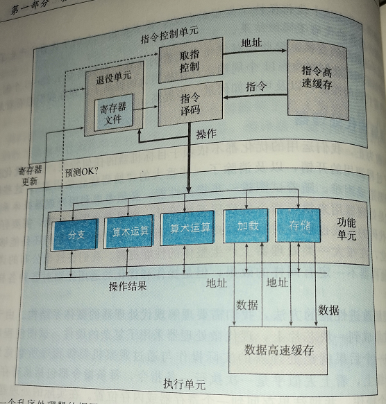
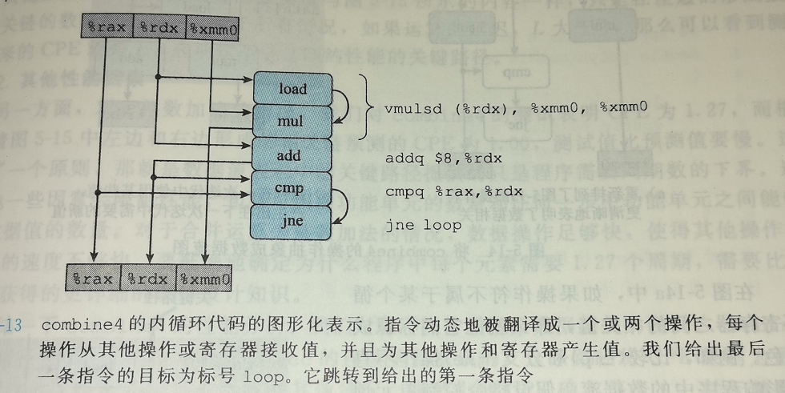
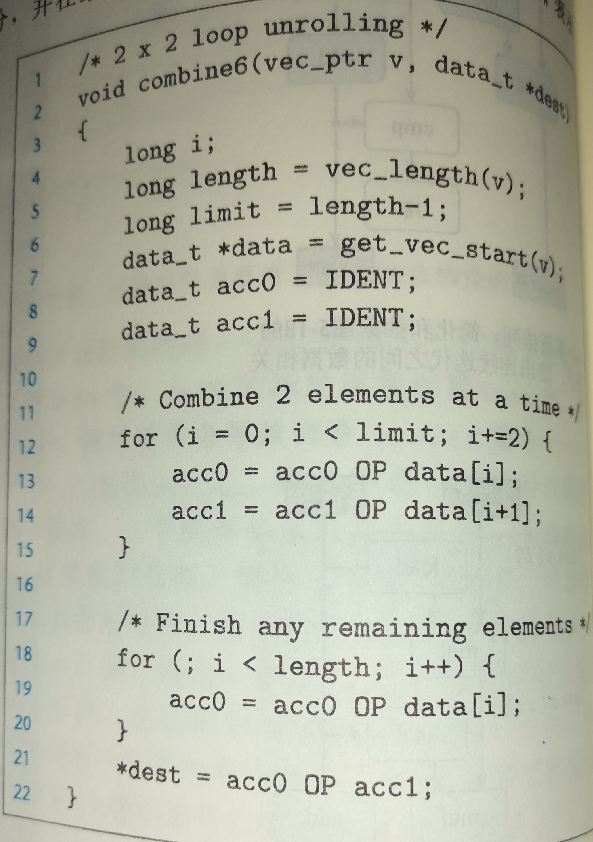

## 第5章 优化程序性能

[TOC]

------


### 5.1 优化编译器的能力和局限性


------


### 5.2 表示程序性能

**每元素的周期数(Cycles Per Element, CPE)**


------


### 5.3 程序示例


### 5.4 消除循环的低效率


### 5.5 减少调用过程


### 5.6 消除不必要的内存引用


### 5.7 理解现代处理器


#### 整体操作

整体设计的两个主要部分：

- **指令控制单元**
- **执行单元**




一条指令会被分割成多个微操作，然后由多个专门的硬件单元并行执行，也就是将微操作作为基本单元


加载单元和存储单元都有一个加法器来完成地址计算


退役单元记录着正在执行的处理，并确保它遵守机器级程序的顺序语义


数据转发技术可以在各个功能单元之间直接传送数据


**寄存器重命名(register renaming)**, 通过维护一张寄存器命与标记的表，实现数据转发以及分支预测


#### 功能单元的性能


#### 处理器操作抽象模型





数据相关的操作限制了执行顺序，这就是关键路径，需要用延迟界限来描述。


### 5.8 循环展开


------


### 5.9 提高并行性


#### 多个积累变量




将循环进行 2 * 2 展开


展开因子K >= 容量C * 延迟L，此时才能保证所有功能单元的流水线都是满的


#### 重新结合变换

将算法进行重新组合，使得关键路径上的运算的源数据脱离关键路径


------


### 5.11 限制因素

关键路径指明了执行该程序需要的时间的基本下界


#### 寄存器溢出


#### 分支预测和预测错误

```c
void minmax2 ( long a[], long b[], long n ){

    long i;
    for( i = 0; i < n; i++ ){
        long min = a[i] < b[i] ? a[i] : b[i];
        long max = a[i] > b[i] ? a[i] : b[i];
        a[i] = min;
        b[i] = max;
    }

}
```

gcc -Og 反汇编

```asm
obj/minmax2.o：     文件格式 elf64-x86-64


Disassembly of section .text:

0000000000000000 <minmax2>:
   0:	41 b8 00 00 00 00    	mov    $0x0,%r8d;set i
   6:	eb 2d                	jmp    35 <minmax2+0x35>; jump to test
   8:	4e 8d 14 c5 00 00 00 	lea    0x0(,%r8,8),%r10;address of i to add
   f:	00 
  10:	4e 8d 0c 16          	lea    (%rsi,%r10,1),%r9;address of b[i]
  14:	49 8b 09             	mov    (%r9),%rcx;b[i]
  17:	49 01 fa             	add    %rdi,%r10;address of a[i]
  1a:	49 8b 02             	mov    (%r10),%rax;a[i]
  1d:	48 39 c1             	cmp    %rax,%rcx;test "b[i] - a[i]"
  20:	49 89 c3             	mov    %rax,%r11;mov a[i] to a[i]tmp
  23:	4c 0f 4e d9          	cmovle %rcx,%r11;mov b[i] to a[i]tmp if b[i] <= a[i]
  27:	48 0f 4d c1          	cmovge %rcx,%rax;if b[i] >= a[i] , mov b[i] to a[i]tmp, and a[i] is a[i]tmp before that 
  2b:	4d 89 1a             	mov    %r11,(%r10);mov a[i]tmp to a[i]
  2e:	49 89 01             	mov    %rax,(%r9);mov b[i]tmp to b[i]
  31:	49 83 c0 01          	add    $0x1,%r8;i++
  35:	49 39 d0             	cmp    %rdx,%r8
  38:	7c ce                	jl     8 <minmax2+0x8>
  3a:	f3 c3                	repz retq 
```


在不影响程序逻辑和不触发语法错误的情况下，将条件跳转转换为条件传送，提高性能


------

### 5.12 理解内存性能


**加载单元和储存单元有内部的缓存区和储存区，可以保存72个读请求和42个写请求**


#### 加载的性能


#### 存储的性能

当循环中的读数据依赖于上一次遍历的写数据时，形成数据相关，不可避免地不能并行


#### 应用：性能提高技术

- **高级设计**
  - 选择适当算法和数据结构
- **基本编码原则**
  - 避免限制优化的因素
  - 消除连续的函数调用
  - 消除不必要的内存引用
- **低级优化**
  - 展开循环
  - 通过使用例如多个累计变量重新结合等技术
  - 用功能性的风格重写操作，例如编译采用条件数据传送


------

### 5.13 确认和消除性能瓶颈


#### 程序剖析


**GPROF 工具**

- gcc -Og -pg c_source_file -o excuted_file
- ./excuted_file 执行后会产生一个文件gmon.out
- gprof excuted_file


