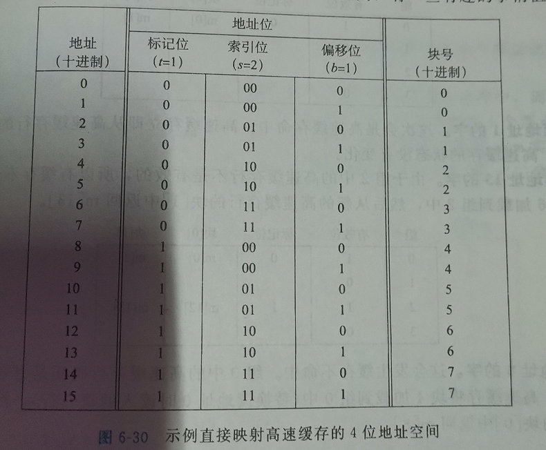

## 第6章 储存器层次结构

[TOC]

------

### 6.1 存储技术


#### 随机访问储存器


**传统的DRAM**

- 分为d个超单元，每个超单元由w个DRAM单元组成


**内存模块**


并行访问多个DRAM模块的同一个超单元地址上的内容，合并成一个64位的字


**增强的 DRAM**

- 快页模式DRAM（Fast Page Mode DRAM, FPM DRAM）
  - 不同于每一次访问超单元都是发送一对完整的RAS/CAS请求，如果一次连续请求超单元都在同一行，那么只需要发送一对RAS/CAS请求后，发送CAS请求即可继续访问同一行的内容，利用的是内部缓冲区中的整行。
- 扩展数据输出 DRAM（Extended Data Out DRAM, EDO DRAM）
  - FPM DRAM 的增强形式，允许各个CAS信号在时间上靠的更紧密一点
- 同步 DRAM（Synchronous DRAM, SDRAM）
- 双倍数据速率同步 DRAM（Double Data-Rate Synchronous DRAM, DDR SDRAM）
- 视频 RAM（Video RAM, VRAM）


**非易失性储存器**

- PROM (Programmable ROM)
- 可擦写可编程(Erasable Programmable ROM, EPROM)
- 闪存(flash memory), 基于电子可擦写 PROM(Electrically Erasable PROM, EEPROM)

储存在ROM设备中的程序通常被称为固件（firmware）,就像PC的BIOS


**访问主存**


I/O桥连接器的芯片组包括内存控制器


#### 磁盘储存


**磁盘容量**
$$
磁盘容量=\frac{字节数}{扇区}*\frac{平均扇区数}{磁道}*\frac{磁道数}{表面}*\frac{表面数}{盘片}*\frac{盘片数}{磁盘}
$$


**磁盘操作**

多个盘片对应多个磁头，平行移动


磁头距离磁盘表面只有约0.1微米


- 寻道时间，平均3-9ms，最大可达20ms
- 旋转时间，最大旋转时间就是磁头到达对应磁道，但是刚好错过目标扇区，就需要大约旋转一周，时间为 1周/转速
- 传送时间，


**逻辑磁盘块**

磁盘控制器维护着逻辑块号和物理磁盘扇区的关系


**格式化包括标识扇区之间的空隙，识别出表面有故障的柱面并弃用，以及在每个区中流出一组煮面作为备用**


**连接I/O设备**

图形卡（显卡）、监视器、鼠标、键盘、磁盘都是通过I/O总线连接

例如Intel的外围设备互连（Peripheral Component Interconnect, PCI）总线连接到CPU和主存。  


有三总不同类型的设备通过I/O总线连接

- 通用串行总线（Universal Serial Bus, USB），固态硬盘也是连接在这里
- 图形卡（图形适配器）
- 主机总线适配器将一个或多个磁盘连接到I/O总线，使用特别的主机总线接口定义的通信协议。例如 SCSI， SATA


**访问磁盘**


使用一种称为**内存映射I/O**的技术来向I/O设备发射命令


磁盘控制器收到来自CPU的命令之后，开始向目标内存地址传送数据，这个过程不需要CPU控制，称为 **直接内存访问（Direct Memory Access, DMA）**,这种传送称为DMA传送

访问结束时，磁盘控制器发送一个中断信号，使得cpu停止当前工作并跳转到一个例程记录访问结束信息


#### 固态硬盘

固态硬盘（Solid State Disk， SSD），基于闪存的存储技术


闪存翻译层是一个硬件/固件设备，与磁盘控制器是相同的角色


页的大小 512字节 ~ 4KB

块的大小 16KB ~ 512KB, 约合 32 ~ 128 页

数据的读写单位为页


#### 存储技术趋势


------


### 6.2 局部性


#### 对程序数据引用的局部性

当步长为1时称 具有空间局部性


#### 取指令的局部性


### 6.3 存储器层次结构


#### 存储器层次结构中的缓存


#### 存储器层次结构概念小结


### 6.4 高速缓存存储器


#### 直接映射高速缓存

每个组只有一行被称为 **直接映射高速缓存(direct-mappped cache)**


**直接映射高速缓存中的组选择**


**直接映射高速缓存中的行匹配**


**直接映射高速内存中的字选择**


**直接映射高速缓存中的不命中时的行替换**


**综合：运行中的直接映射高速缓存**




**直接映射高速缓存中的冲突不命中**


```c
float dotprod ( float x[8], float y[8]){

    float sum = 0.0;
    int i;
    
    for (i = 0; i < 8; i++){
        sum += x[i] * y[i];
    }
    
    return sum;

}
```


此时若高速缓存为2个组，每个组的块为4个字节，组数与数组数一样都是2，就会发生抖动


#### 组相联高速缓存

