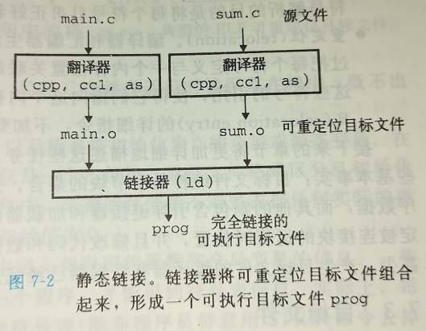
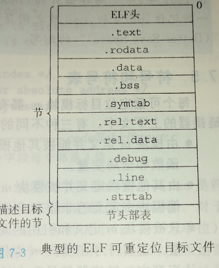
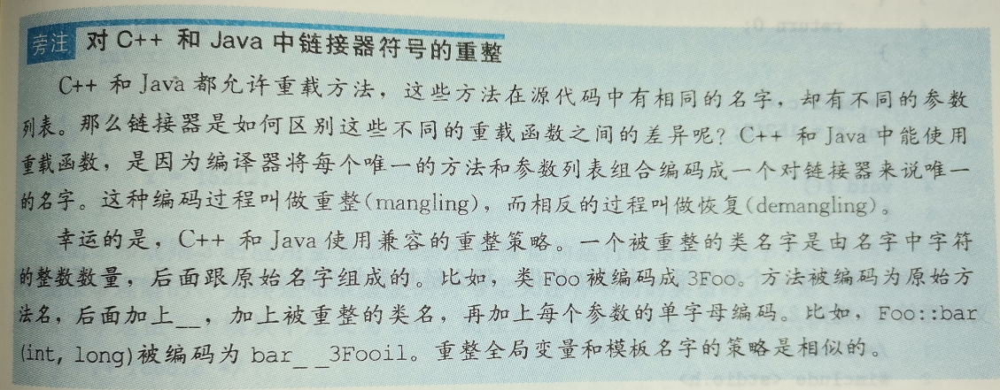
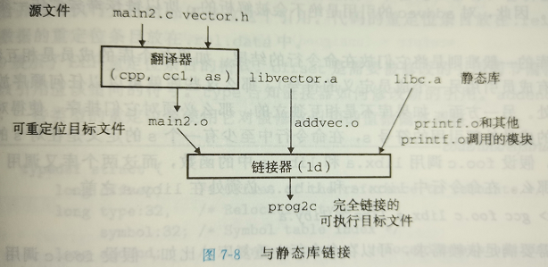
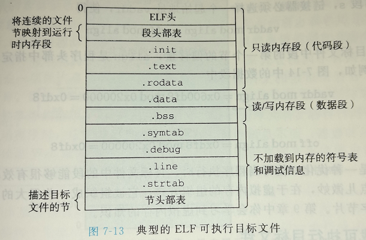
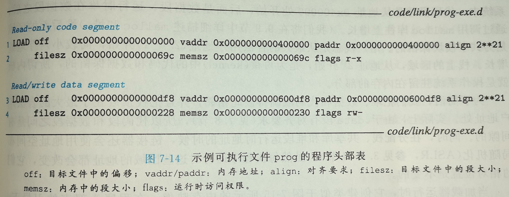
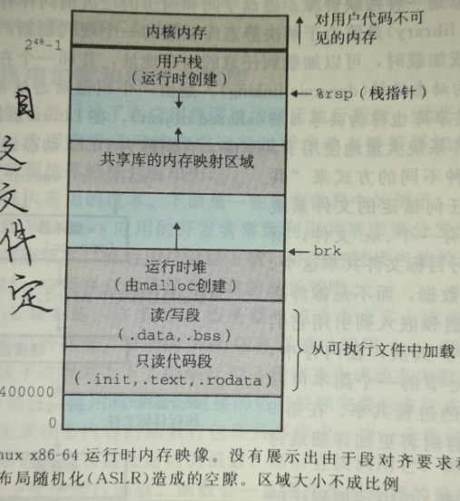
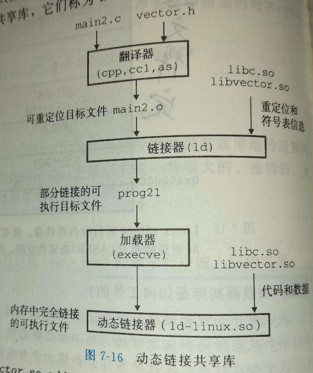
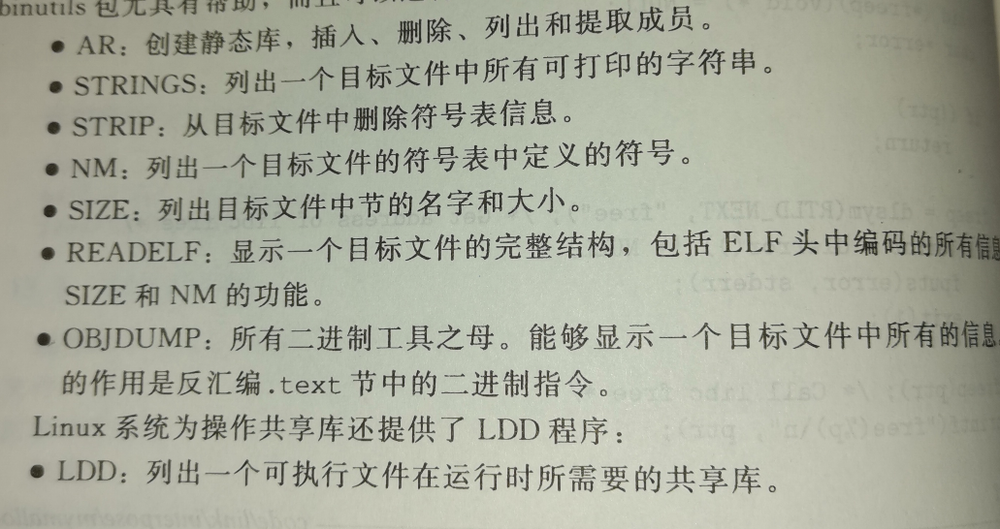

## 第7章 链接

[TOC]

------

### 7.1 编译驱动程序




```shell
[root@localhost test]# gcc -Og -o prog main.c sum.c -v
使用内建 specs。
COLLECT_GCC=gcc
COLLECT_LTO_WRAPPER=/usr/libexec/gcc/x86_64-redhat-linux/4.8.5/lto-wrapper
目标：x86_64-redhat-linux
配置为：../configure --prefix=/usr --mandir=/usr/share/man --infodir=/usr/share/info --with-bugurl=http://bugzilla.redhat.com/bugzilla --enable-bootstrap --enable-shared --enable-threads=posix --enable-checking=release --with-system-zlib --enable-__cxa_atexit --disable-libunwind-exceptions --enable-gnu-unique-object --enable-linker-build-id --with-linker-hash-style=gnu --enable-languages=c,c++,objc,obj-c++,java,fortran,ada,go,lto --enable-plugin --enable-initfini-array --disable-libgcj --with-isl=/builddir/build/BUILD/gcc-4.8.5-20150702/obj-x86_64-redhat-linux/isl-install --with-cloog=/builddir/build/BUILD/gcc-4.8.5-20150702/obj-x86_64-redhat-linux/cloog-install --enable-gnu-indirect-function --with-tune=generic --with-arch_32=x86-64 --build=x86_64-redhat-linux
线程模型：posix
gcc 版本 4.8.5 20150623 (Red Hat 4.8.5-39) (GCC) 
COLLECT_GCC_OPTIONS='-Og' '-o' 'prog' '-v' '-mtune=generic' '-march=x86-64'
 /usr/libexec/gcc/x86_64-redhat-linux/4.8.5/cc1 -quiet -v main.c -quiet -dumpbase main.c -mtune=generic -march=x86-64 -auxbase main -Og -version -o /tmp/ccqW1LFo.s
GNU C (GCC) 版本 4.8.5 20150623 (Red Hat 4.8.5-39) (x86_64-redhat-linux)
	由 GNU C 版本 4.8.5 20150623 (Red Hat 4.8.5-39) 编译，GMP 版本 6.0.0，MPFR 版本 3.1.1，MPC 版本 1.0.1
GGC 准则：--param ggc-min-expand=100 --param ggc-min-heapsize=131072
忽略不存在的目录“/usr/lib/gcc/x86_64-redhat-linux/4.8.5/include-fixed”
忽略不存在的目录“/usr/lib/gcc/x86_64-redhat-linux/4.8.5/../../../../x86_64-redhat-linux/include”
#include "..." 搜索从这里开始：
#include <...> 搜索从这里开始：
 /usr/lib/gcc/x86_64-redhat-linux/4.8.5/include
 /usr/local/include
 /usr/include
搜索列表结束。
GNU C (GCC) 版本 4.8.5 20150623 (Red Hat 4.8.5-39) (x86_64-redhat-linux)
	由 GNU C 版本 4.8.5 20150623 (Red Hat 4.8.5-39) 编译，GMP 版本 6.0.0，MPFR 版本 3.1.1，MPC 版本 1.0.1
GGC 准则：--param ggc-min-expand=100 --param ggc-min-heapsize=131072
Compiler executable checksum: edd9a53947039836c859e437e8c9af72
COLLECT_GCC_OPTIONS='-Og' '-o' 'prog' '-v' '-mtune=generic' '-march=x86-64'
 as -v --64 -o /tmp/ccd4i0aR.o /tmp/ccqW1LFo.s
GNU assembler version 2.27 (x86_64-redhat-linux) using BFD version version 2.27-41.base.el7_7.3
COLLECT_GCC_OPTIONS='-Og' '-o' 'prog' '-v' '-mtune=generic' '-march=x86-64'
 /usr/libexec/gcc/x86_64-redhat-linux/4.8.5/cc1 -quiet -v sum.c -quiet -dumpbase sum.c -mtune=generic -march=x86-64 -auxbase sum -Og -version -o /tmp/ccqW1LFo.s
GNU C (GCC) 版本 4.8.5 20150623 (Red Hat 4.8.5-39) (x86_64-redhat-linux)
	由 GNU C 版本 4.8.5 20150623 (Red Hat 4.8.5-39) 编译，GMP 版本 6.0.0，MPFR 版本 3.1.1，MPC 版本 1.0.1
GGC 准则：--param ggc-min-expand=100 --param ggc-min-heapsize=131072
忽略不存在的目录“/usr/lib/gcc/x86_64-redhat-linux/4.8.5/include-fixed”
忽略不存在的目录“/usr/lib/gcc/x86_64-redhat-linux/4.8.5/../../../../x86_64-redhat-linux/include”
#include "..." 搜索从这里开始：
#include <...> 搜索从这里开始：
 /usr/lib/gcc/x86_64-redhat-linux/4.8.5/include
 /usr/local/include
 /usr/include
搜索列表结束。
GNU C (GCC) 版本 4.8.5 20150623 (Red Hat 4.8.5-39) (x86_64-redhat-linux)
	由 GNU C 版本 4.8.5 20150623 (Red Hat 4.8.5-39) 编译，GMP 版本 6.0.0，MPFR 版本 3.1.1，MPC 版本 1.0.1
GGC 准则：--param ggc-min-expand=100 --param ggc-min-heapsize=131072
Compiler executable checksum: edd9a53947039836c859e437e8c9af72
COLLECT_GCC_OPTIONS='-Og' '-o' 'prog' '-v' '-mtune=generic' '-march=x86-64'
 as -v --64 -o /tmp/cczGTkMj.o /tmp/ccqW1LFo.s
GNU assembler version 2.27 (x86_64-redhat-linux) using BFD version version 2.27-41.base.el7_7.3
COMPILER_PATH=/usr/libexec/gcc/x86_64-redhat-linux/4.8.5/:/usr/libexec/gcc/x86_64-redhat-linux/4.8.5/:/usr/libexec/gcc/x86_64-redhat-linux/:/usr/lib/gcc/x86_64-redhat-linux/4.8.5/:/usr/lib/gcc/x86_64-redhat-linux/
LIBRARY_PATH=/usr/lib/gcc/x86_64-redhat-linux/4.8.5/:/usr/lib/gcc/x86_64-redhat-linux/4.8.5/../../../../lib64/:/lib/../lib64/:/usr/lib/../lib64/:/usr/lib/gcc/x86_64-redhat-linux/4.8.5/../../../:/lib/:/usr/lib/
COLLECT_GCC_OPTIONS='-Og' '-o' 'prog' '-v' '-mtune=generic' '-march=x86-64'
 /usr/libexec/gcc/x86_64-redhat-linux/4.8.5/collect2 --build-id --no-add-needed --eh-frame-hdr --hash-style=gnu -m elf_x86_64 -dynamic-linker /lib64/ld-linux-x86-64.so.2 -o prog /usr/lib/gcc/x86_64-redhat-linux/4.8.5/../../../../lib64/crt1.o /usr/lib/gcc/x86_64-redhat-linux/4.8.5/../../../../lib64/crti.o /usr/lib/gcc/x86_64-redhat-linux/4.8.5/crtbegin.o -L/usr/lib/gcc/x86_64-redhat-linux/4.8.5 -L/usr/lib/gcc/x86_64-redhat-linux/4.8.5/../../../../lib64 -L/lib/../lib64 -L/usr/lib/../lib64 -L/usr/lib/gcc/x86_64-redhat-linux/4.8.5/../../.. /tmp/ccd4i0aR.o /tmp/cczGTkMj.o -lgcc --as-needed -lgcc_s --no-as-needed -lc -lgcc --as-needed -lgcc_s --no-as-needed /usr/lib/gcc/x86_64-redhat-linux/4.8.5/crtend.o /usr/lib/gcc/x86_64-redhat-linux/4.8.5/../../../../lib64/crtn.o
```


main.c

```c
int sum( int a[], int n );

int array[2] = {1, 2};

int main(){

    int val = sum(array, 2);
    return val;

}
```


sum.c

```c
int sum( int a[], int n ){

    int i, s = 0;

    for ( i = 0; i < n; i++ ){
        s += a[i];
    }

    return s;

}
```


**预处理**

cpp main.c /tmp/main.i

cpp sum.c /tmp/sum.i


**编译译成汇编文件**

cc /tmp/main.i -Og -o /tmp/main.s

cc /tmp/sum.i -Og -o /tmp/sum.s


**汇编器生成可重定位目标文件**

as -o /tmp/main.o /tmp/main.s

as -o /tmp/sum.o /tmp/sum.s


**链接**

ld -o prog /tmp/main.c /tmp/sum.o


**执行**

./prog


------

### 7.2 静态链接


- 符号解析
  - 将每个符号引用正好和一个符号定义关联起来
- 重定义
  - 链接器通过把每个符号定义与内存位置关联起来，从而重定位这些节，修改所有对这些符号的引用


目标文件是纯粹的字节块集合，有的包含程序代码，有的包含程序数据，也有的包含引导连接器和加载器的数据结构


------

### 7.3 目标文件

三中形式：

- 可重定位目标文件
- 可执行目标文件
- 共享目标文件


------

### 7.4 可重定位目标文件




- .text, 已编译的机器代码
- .rodata, 只读数据
- .data, 已初始化的全局和静态C变量
- .bss, 未初始化的全局和静态C变量，以及所有被初始化为0的全局或静态变量。
- .symtab, 一个符号表，存放着在程序中定义和引用的函数和全局变量的信息。
- .rel.text, 一个.text 节中位置的列表
- .debug, 一个调试符号表，其条目是程序中定义的局部变量的类型和定义，程序中定义和引用的全局变量，以及原始的C源文件。
- .line 原始源程序中的行号和.text中机器指令之间的映射。
- .strtab，一个符号串表，其内容包括.symtab 和 .debug 节中的符号表，以及街头部中的节名字


------

### 7.5 符号和符号表

对于一个模块m有三种不同的符号：

- 由模块m定义并能被其他模块引用的全局符号。
- 由其他模块定义并被模块m引用的全局符号。
- 只被模块m定义和引用的局部符号。


·任何带有static属性生命的全局变量或者函数都是模块私有的。


**查看位于 .symtab节中的ELF符号表**

```c
############main.c###############
int sum(int *a, int n);

int array[2] = {1, 2};

int main()
{
    int val = sum(array, 2);
    return val;
}
############sum.c###############
int sum(int *a, int n)
{
    int i, s = 0;

    for(int i = 0; i < n; i++){
        s += a[i];
    }
    return s;
}

readelf -s main.o

Symbol table '.symtab' contains 12 entries:
   Num:    Value          Size Type    Bind   Vis      Ndx Name
     0: 0000000000000000     0 NOTYPE  LOCAL  DEFAULT  UND
     1: 0000000000000000     0 FILE    LOCAL  DEFAULT  ABS main.c
     2: 0000000000000000     0 SECTION LOCAL  DEFAULT    1
     3: 0000000000000000     0 SECTION LOCAL  DEFAULT    3
     4: 0000000000000000     0 SECTION LOCAL  DEFAULT    4
     5: 0000000000000000     0 SECTION LOCAL  DEFAULT    6
     6: 0000000000000000     0 SECTION LOCAL  DEFAULT    7
     7: 0000000000000000     0 SECTION LOCAL  DEFAULT    5
     8: 0000000000000000    26 FUNC    GLOBAL DEFAULT    1 main
     9: 0000000000000000     8 OBJECT  GLOBAL DEFAULT    3 array
    10: 0000000000000000     0 NOTYPE  GLOBAL DEFAULT  UND _GLOBAL_OFFSET_TABLE_
    11: 0000000000000000     0 NOTYPE  GLOBAL DEFAULT  UND sum

readelf -S main.o
There are 12 section headers, starting at offset 0x2c0:

Section Headers:
  [Nr] Name              Type             Address           Offset
       Size              EntSize          Flags  Link  Info  Align
  [ 0]                   NULL             0000000000000000  00000000
       0000000000000000  0000000000000000           0     0     0
  [ 1] .text             PROGBITS         0000000000000000  00000040
       000000000000001a  0000000000000000  AX       0     0     1
  [ 2] .rela.text        RELA             0000000000000000  00000218
       0000000000000030  0000000000000018   I       9     1     8
  [ 3] .data             PROGBITS         0000000000000000  00000060
       0000000000000008  0000000000000000  WA       0     0     8
  [ 4] .bss              NOBITS           0000000000000000  00000068
       0000000000000000  0000000000000000  WA       0     0     1
  [ 5] .comment          PROGBITS         0000000000000000  00000068
       000000000000002c  0000000000000001  MS       0     0     1
  [ 6] .note.GNU-stack   PROGBITS         0000000000000000  00000094
       0000000000000000  0000000000000000           0     0     1
  [ 7] .eh_frame         PROGBITS         0000000000000000  00000098
       0000000000000030  0000000000000000   A       0     0     8
  [ 8] .rela.eh_frame    RELA             0000000000000000  00000248
       0000000000000018  0000000000000018   I       9     7     8
  [ 9] .symtab           SYMTAB           0000000000000000  000000c8
       0000000000000120  0000000000000018          10     8     8
  [10] .strtab           STRTAB           0000000000000000  000001e8
       000000000000002d  0000000000000000           0     0     1
  [11] .shstrtab         STRTAB           0000000000000000  00000260
       0000000000000059  0000000000000000           0     0     1
```


### 7.6 符号解析




#### 链接器如何解析多重定义的全局变量

**强符号为 函数和已初始化的全局变量**

**弱符号为 未初始化的全局变量**

- 规则一，不允许有多个同名的强符号
- 规则二，若强符号和多个弱符号同名，那么选择强符号
- 规则三，如果多个弱符号同名，选择任意一个


bar5.c

```c
double x;

void f(){

  x = -0.0;

}
```


foo5.c

```c
#include<stdio.h>

void f(void);

int y = 15212;
int x = 15213;

int main(){
    
    f();
    int ys = sizeof(y);
    int xs = sizeof(x);
    printf("x = 0x%x, sizeof(x) = %d \ny = 0x%x, sizeof(y) = %d \n",x ,xs ,y , ys);
    return 0;

}
```

```shell
[root@localhost test]# gcc foo5.c bar5.c -o foobar5
\/usr/bin/ld: Warning: alignment 4 of symbol `x' in /tmp/cchQmhCb.o is smaller than 8 in /tmp/cctylJNL.o
[root@localhost test]# ./foobar5
x = 0x0, sizeof(x) = 4 
y = 0x3b6c, sizeof(y) = 4 
```

同名强符号覆盖弱符号

重复定义强符号将error


#### 与静态库链接




打包自己的模块称为.a静态库，在gcc -static 静态编译时，使用 -L[path] 指明静态库路径，-l[headfile]指明头文件


[root@localhost test]# gcc -static -o prog2c main2.o -L. -lvector


#### 连接启如何使用静态库来解析引用

链接器维护一个可重定位的目标文件的集合E

一个未解析符号集合U

一个在输入文件中已定义的符号集合D


### 7.7 重定位

重定位分为两个步骤组成：

- **重定位节和符号定义。 将输入模块中同类节聚合为新的聚合节**
- **重定位节中的符号引用。 将符号引用指向正确的运行时地址**


#### 重定位条目

.rel.data 和 .rel.text

```c
typedef struct {
    long offset;
    long type:32,
    	 symbol:32;
    long addend;
}Elf64_Rela;
```


#### 重定义符号引用


**重定位PC相对引用**

```c
foreach section s{//节
    foreach relocation entry r{//条目
        reptr = s + r.offset;//指向被重定位的引用的指针，由 节地址 加上 条目中的被修改引用对应的偏移地址
        
        if (r.type == R_X86_64_PC32){
            refaddr = ADDR(s) + r.offset;//引用的运行时地址
            *refptr = (unsigned) (ADDR(r.symbol) + r.addend - refaddr);//符号的运行时地址 + 条目中的重定位位移调整(-占位符大小) - 引用的运行时地址(占位符首地址) ，结果等于 被引用代码地址-调用call指令时的PC值，然后替换在占位符上
        }
        
        if (r.type == R_X86_64_32){
            *refptr = (unsigned) (ADDR(r.symbol) + r.addend);//符号的运行时地址 + 条目中的重定位位移调整
        }
        
    }
}
```


**重定位绝对引用**


------

### 7.8 可执行目标文件




```shell
程序头：
    PHDR off    0x0000000000000040 vaddr 0x0000000000400040 paddr 0x0000000000400040 align 2**3
         filesz 0x00000000000001f8 memsz 0x00000000000001f8 flags r-x
  INTERP off    0x0000000000000238 vaddr 0x0000000000400238 paddr 0x0000000000400238 align 2**0
         filesz 0x000000000000001c memsz 0x000000000000001c flags r--
    LOAD off    0x0000000000000000 vaddr 0x0000000000400000 paddr 0x0000000000400000 align 2**21
         filesz 0x00000000000006f4 memsz 0x00000000000006f4 flags r-x
    LOAD off    0x0000000000000e10 vaddr 0x0000000000600e10 paddr 0x0000000000600e10 align 2**21
         filesz 0x0000000000000224 memsz 0x0000000000000228 flags rw-
 DYNAMIC off    0x0000000000000e28 vaddr 0x0000000000600e28 paddr 0x0000000000600e28 align 2**3
         filesz 0x00000000000001d0 memsz 0x00000000000001d0 flags rw-
    NOTE off    0x0000000000000254 vaddr 0x0000000000400254 paddr 0x0000000000400254 align 2**2
         filesz 0x0000000000000044 memsz 0x0000000000000044 flags r--
EH_FRAME off    0x00000000000005b0 vaddr 0x00000000004005b0 paddr 0x00000000004005b0 align 2**2
         filesz 0x000000000000003c memsz 0x000000000000003c flags r--
   STACK off    0x0000000000000000 vaddr 0x0000000000000000 paddr 0x0000000000000000 align 2**4
         filesz 0x0000000000000000 memsz 0x0000000000000000 flags rw-
   RELRO off    0x0000000000000e10 vaddr 0x0000000000600e10 paddr 0x0000000000600e10 align 2**0
         filesz 0x00000000000001f0 memsz 0x00000000000001f0 flags r-
```




1、2行：开始于 vaddr  的地址，总共内存为 memsz ，被初始化为可执行目标文件的 filesz,  内存包括ELF头部、程序头部表、.init 、.text 、.rodata

值得注意的是，第4行中menz - filesz=8，对应的就是.bss的内容


------

### 7.9 加载可执行目标文件





在程序头部表的引导下，**加载器**将可执行文件的片(chunk) 复制到代码段和数据段


------

### 7.10 动态链接共享库





### 7.11 从应用程序中加载和链接共享库


```c
#include<stdio.h>
#include<stdlib.h>
#include<dlfcn.h>

int x[2] = {1, 2};
int y[2] = {3, 4};
int z[2];
typedef void (*ADDVEC)(int *, int *, int *, int);

int main(){

    void *handle;
    ADDVEC addvec;
    char *error;

    handle = dlopen("./libvector.so", RTLD_LAZY);//获取动态共享库的句柄
    if(!handle){
        fprintf(stderr, "%s\n", dlerror());
        exit(1);
    }

    addvec = (ADDVEC)dlsym(handle, "addvec");//在动态共享库中提取符号的索引，并强制转换为ADDVEC类型函数指针
    if ((error = dlerror()) != NULL){
        fprintf(stderr, "%s\n", error);
        exit(1);
    }

    addvec(x, y, z, 2);//应用
    printf("z = [%d %d] \n", z[0], z[1]);

    if(dlclose(handle) < 0){//关闭动态共享库
        fprintf(stderr, "%s\n", dlerror());
        exit(1);
    }
    
    return 0;

}
```


------

### 7.12 位置无关代码

可以加载而无需重定位的代码称为 **位置无关代码( Position-Independent Code, PIC)**


**全局偏移量表(Global Offset Table, GOT)**, 每一个条目为8字节，对应每一个共享库中被调用的全局过程或变量


**过程链接表（Procedure Linkage Table, PLT）**, 每个条目为16字节，对应每一个GOT条目


延迟绑定，初始化 GOT表中被调用函数的地址为PLT表中对应指令的下一条指令，第一次调用时间接跳转到PLT的对应下一条指令，将指令符号ID推入栈中，然后跳转到位于PLT[0]间接地把动态链接器的一个参数压入栈中，然后通过GOT[2]跳转到动态链接器，动态链接器使用两个栈条目来确定被调用函数的运行时地址，并覆盖GOT中对应的条目


GOT的前3项包含了一些特殊的值：GOT[0]中保存的是.dynamic段的地址，其中保存着动态链接器用来绑定过程地址所需要的信息，包括符号表的位置和重定位信息。GOT[1]中保存着当前模块的一些信息。GOT[2]是动态链接器延迟绑定代码的入口地址。每个被调用的动态对象中的函数在GOT中都有一个对应的表项，从GOT[3]开始。比如，定义在libc.so的printf，以及定义在libvector.so的addvec。
下面的代码展示了PLT的内容。PLT是16字节表项构成的数组。第一项PLT[0]是一个特殊项，为跳到动态链接器的入口。从PLT[1]开始，每一个被调用的函数在PLT中都有对应项，其中，PLT[1]对应printf，PLT[2]对应addvec.


```asm
PLT[0]
08048444:	pushl	$GOT[1]
		jmp to	*GOT[2](linker)	 
		padding
		padding

PLT[1] <printf>
8048454:	jmp to	*GOT[3]
		pushl   $0x0 	ID for	printf
		jmp to	PLT[0]

PLT[2] <addvec>
8048464:	jmp to *GOT[4]
		pushl   $0x8	ID for	addvec
		jmp to	PLT[0]

<other PLT entries>
```


在程序被动态链接之后并开始执行时，函数printf和addvec被绑定到相应PLT项的第一条指令，比如，对addvec的调用为：


```asm
call 8048464 <addvec>
```


当addvec第一次被调用时，PLT[2]的第一条指令被执行，即间接跳转到GOT[4]保存的地址。GOT表项的初始值为PLT表项中的pushl指令的地址。因此，跳转后的执行指令重新回到了PLT表项的第二条指令。这条指令将addvec符号的ID压入栈中。然后下一条指令跳转到PLT[0]，将另一个存放于GOT[1]中的标识信息字压入栈，然后通过GOT[2]间接跳转到动态链接器。动态链接器通过栈中的这两项数据来定位addvec，并用其覆盖GOT[4]的值，然后将控制权交给addvec。

当下次addvec被调用时，同之前一样，先是执行PLT[2]的第一条指令。但是这次将通过GOT[2]直接跳转到addvec。所增加的开销只是间接跳转所需的内存引用。


------

### 7.13 库打桩机制


### 7.14 处理目标文件的工具

