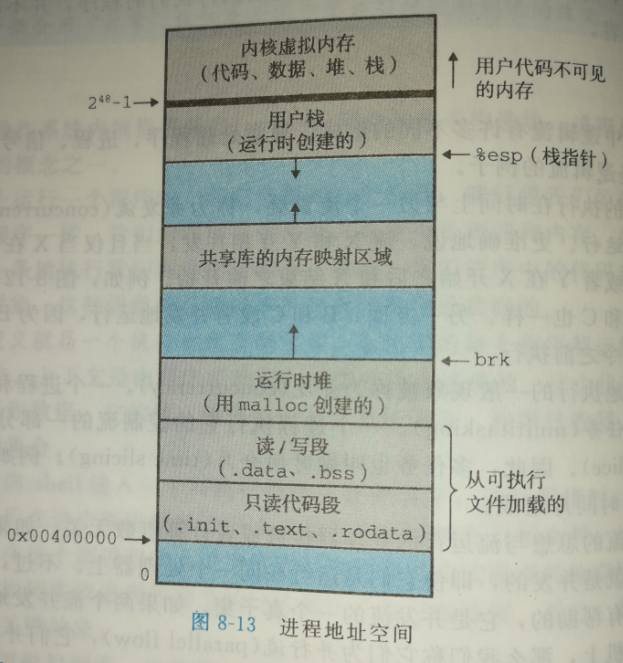

## 第8章 异常控制流

[TOC]

------

### 8.1 异常


#### 异常的类别

| 类别            | 原因              | 同步/异步 | 返回行为             |
| --------------- | ----------------- | --------- | -------------------- |
| 中断(interrupt) | 来自I/O设备的信号 | 异步      | 总是返回到下一条指令 |
| 陷阱(trap)      | 有意的异常        | 同步      | 总是返回到下一条指令 |
| 故障(fault)     | 潜在可恢复的错误  | 同步      | 可能返回到当前指令   |
| 终止(abort)     | 不可恢复的错误    | 同步      | 不会返回             |


陷阱最重要的用途是再用户程序和内核之间提供一个像过程一样的接口，叫做系统调用

用户程序常常向内核请求服务：

- 读取文件(read)
- 创建一个新进程(frok)
- 加载一个新的程序(execuve)
- 终止当前进程(exit)


#### Linux/x86_64 系统中的异常

**1. Linux/x86_64 故障和终止**

- 除法错误（0）
- 一般保护错误（13），也称段错误（Segmentation fault）,引用了一个未定义的虚拟内存区域，或者试图写一个只读的文本段
- 缺页（14）
- 机器检查（18），检测到致命的硬件错误时发生的


**2. Linux86-64 系统调用**


系统调用只用寄存器传递参数，而函数调用可以用栈传递参数


机器级系统调用


------

### 8.2 进程

#### 逻辑控制流


#### 并发流


#### 私有地址空间




#### 用户模式和内核模式


#### 上下文切换

1. 保存当前进程的上下文
2. 恢复某个先前被抢占的进程被保存的上下文
3. 将控制递交给这个新恢复的进程


------

### 8.4 进程控制


```c
#include <sys/types.h>
#include <unistd.h>
#include <stdio.h>
#include <stdlib.h>

int main(){

    pid_t pid;
    int x = 1;

    pid = fork();
    if( pid == 0 ){
        printf("child: x = %d \n", ++x);
        exit(0);
    }

    printf("parent: x = %d \n", --x);
    exit(0);
}
```

输出：

```shell
parent: x = 0 
child: x = 2 
```


```c
void test3(){
 
    printf("hello");
    Fork();
    Fork();
    printf(" world!\n");
    exit(0);

}
```

输出：

```shell
[root@localhost test]# ./a.out
hello world!
hello world!
hello world!
hello world!
```

fork就好像会略过当前语句之前的fork语句一样，不会一直fork


- 调用一次，返回两次。fork执行之后，一次是返回父进程的下一条语句，一次是返回子进程的main函数开头
- 并发执行，绝不能对不同进程指令的顺序进行任何假设
- 相同但是独立的进程空间。
- 共享文件


#### 回收子进程


```c
#include <sys/types.h>
#include <sys/wait.h>

void waitpid( 
	pid_t, 			//指定集合进程id，若id等于-1，则进程集合为当前进程全部子进程
    int *statusp,	//接受一个接收已回收子进程退出状态的指针 
    int options		//修改函数的默认行为
);	
```


#### 加载并运行程序

```c
#include <unistd.h>

int execve(
    const char *filename,	//可执行目标文件名   
    const char *argv[], 	//参数列表，元素是N个指向结尾为NULL的字符串的指针
    const char *envp[]		//指向环境变量数组第一个条目
);
```


```c
#include <stdlib.h>

char* getenv(const char* name);//取环境变量值
```


```c
#include <stdlib.h>

int setenv(
    const char* name,
	const chrar* newvalue,	
    int overwrite			//如果已经存在那么name的值，是否修改
);

void unsetenv(
	const char* name;//删除键值对
);
```


#### 利用fork和execve运行程序

```c
/* $begin shellmain */
#include <csapp.h>
#define MAXARGS   128

/* function prototypes */
void eval(char *cmdline);
int parseline(char *buf, char **argv);//解析原始命令行的参数
int builtin_command(char **argv); 

int main() 
{
    char cmdline[MAXLINE]; /* Command line */

    while (1) {
		/* Read */
		printf("> ");                   
		Fgets(cmdline, MAXLINE, stdin); 
		if (feof(stdin))
			exit(0);

		/* Evaluate */
		eval(cmdline);
    } 
}
/* $end shellmain */
  
/* $begin eval */
/* eval - Evaluate a command line */
void eval(char *cmdline) 
{
    char *argv[MAXARGS]; /* 参数表，条目数量为参数表条目最大值 128 = 2^7 */
    char buf[MAXLINE];   /* 命令缓存，大小字符串最大值 8192 = 2^13 */
    int bg;              /* 是否在后台运行 */
    pid_t pid;           /* 进程ID */
    
    strcpy(buf, cmdline);		// 将传入的命令复制一份作为缓存
    bg = parseline(buf, argv); 	// 解析命令参数
    if (argv[0] == NULL)  		// 如果参数表第一个条目为NULL，说明无命令，返回
	return;   /* Ignore empty lines */

    if (!builtin_command(argv)) {	// 是否为内建命令，是则返回0，进入分支
		if ((pid = Fork()) == 0) {  // 创建子进程
			if (execve(argv[0], argv, environ) < 0) {	// 运行命令
				printf("%s: Command not found.\n", argv[0]);
				exit(0);			// 命令未找到
			}
		}

	/* Parent waits for foreground job to terminate */
		if (!bg) {										// 如果不扔到后台，则等待运行
			int status;
			if (waitpid(pid, &status, 0) < 0)			// 如果返回值为负数，则出错
				unix_error("waitfg: waitpid error");	// 输出错误信息
		}
		else
			printf("%d %s", pid, cmdline);				// 如果后台运行命令，则不等待，并输出命令信息
    }
    return;
}

/* If first arg is a builtin command, run it and return true */
int builtin_command(char **argv) 
{
    if (!strcmp(argv[0], "quit")) /* quit command */
		exit(0);  
    if (!strcmp(argv[0], "&"))    /* Ignore singleton & */
		return 1;
    return 0;                     /* Not a builtin command */
}
/* $end eval */

/* $begin parseline */
/* parseline - Parse the command line and build the argv array */
int parseline(char *buf, char **argv) 
{
    char *delim;         /* Points to first space delimiter */
    int argc;            /* Number of args */
    int bg;              /* Background job? */

    buf[strlen(buf)-1] = ' ';  /* Replace trailing '\n' with space */
    while (*buf && (*buf == ' ')) /* 过滤命令行前面的空格 */
		buf++;

    /* Build the argv list */
    argc = 0;
    while ((delim = strchr(buf, ' '))) {	//将delmin指向每个参数后的空格
		argv[argc++] = buf;					//将每个条目指向参数字符串第一个字母
		*delim = '\0';						//将条目结尾的空格改成结束符
		buf = delim + 1;					//指向下一个字符，有可能是空格
		while (*buf && (*buf == ' ')) 		//过滤空格
	       buf++;
    }
    argv[argc] = NULL;		//将参数表的最后一个条目之后的那一个指针指向NULL
    
    if (argc == 0)  		//如果参数表条目为0，返回 1
		return 1;

    /* Should the job run in the background? */
    if ((bg = (*argv[argc-1] == '&')) != 0)	//如果参数表最后一个条目为&，设置bg为1，并将这个条目过滤掉
		argv[--argc] = NULL;

    return bg;
}
/* $end parseline */
```

这个命令解释器不能回收后台进程


------

### 8.5 信号


**一个信号就是一条小消息，它通知进程系统中发生了一个某种类型的时间**


#### 信号术语

- 发送信号，内核通过更新目的进程的上下文的某个状态，发送一个信号给目的进程。
- 接收信号。当目的进程被内核强迫以某种方式对信号的发送做出反应时，即接收了信号。忽略或者通过执行一个称为 **信号处理程序（signal handler）**的用户层函数处理这个信号。


同一个进程只会有某个类型的一个待处理信号，后续接受的同种类型的信号会被抛弃


进程可以阻塞接受某个类型的信号，但是该类型信号仍然可以被发送


#### 发送信号


```c
#include <unistd.h>

pid_t getpgrp(void);	//返回进程组id
```


```c
#include <unistd.h>

int setpgrp(pid_t pid, pid_t pgid);	//设置成功则返回0，错误返回-1
```

如果 pid 为0，则设置		pid为当前进程的pid

如果 gpid 为0， 则设置	 gpid为当前进程的进程gpid

若都为0， 则设置				两个参数都为当前进程的pid


**从键盘发送信号**

键盘输入ctrl + c 将发送一个SIGINT 信号给前台进程组的每一个进程，并终止前台作业

同样ctrl + z将发送一个SIGTSTP 信号给前台进程组的每一个进程，并停止(挂起)前台作业


**kill函数**

```c
#include <sys/types.h>
#include <signal.h>

int kill (pid_t pid, int sig);//成功则返回0, 否则返回-1
```


**用 alarm 函数发送信号**

```c
#include <unistd.h>

unsigned int alarm(unsigned int secs);//返回待处理闹钟被发送前的秒数
```


------

#### 接收信号

**设置信号处理程序**

```c
#include <signal.h>
typedef void (*sighandler_t)(int);

sighandler_t signal (int signum, sighandler_t handler);//设置接受信号的处理函数，返回值为指向旧处理函数的指针，调用此设置函数出错则返回SIG_ERR，不设置errno
```

如果sighandler_t = SIG_IGN, 表示设置 忽略signum的信号

如果sighandler_t = SIG_DFL，恢复 对signum信号的默认处理程序

否则当接收signum信号时，调用 handler函数


通常，处理程序return时，返回信号开始处理时的中断位置，有时一些系统会在系统调用被中断时直接返回错误


#### 阻塞和接触阻塞信号

隐式阻塞，当信号处理程序正在处理信号s时，此时发送信号s给该进程，将会变成待处理而没有被接收

显式阻塞，使用sigprocmask函数和它的辅助函数，明确地阻塞和接触阻塞选定的信号

```c
#include <signal.h>

int sigprocmask(int how, const sigset_t *set, sigset_t *oldset);
int sigemptyset(sigset_t *set);
int sigfillset(sigset_t *set);
int sigaddset(sigset_t *set, int signum);
int sigdelset(sigset_ *set, int signum);//成功则返回0，否则返回-1
int sigismenber(const sigset_t *set, int signum);//若signum时set的成员则返回1，不是则返回0，出错则返回-1
```


pending是一个以位描述信号类型是否是待处理信号的位向量

blocked是一个以位描述信号类型是否被阻塞的位向量


#### 编写信号处理程序


异步信号安全的函数


SIO包

```c
#include "csapp.h"

ssize_t sio_putl(long v);
ssize_t sio_puts(char s[]);

void sio_error(cahr s[]);
```


**安全的信号处理**规则

1. 处理程序要尽可能简单。
2. 在处理程序中只调用异步信号安全的函数。
3. 保存和恢复errno。
4. 访问全局数据结构时阻塞所有信号。
5. 用valatile声明全局变量。告诉编译器不要用寄存器缓存一个全局变量，否则处理程序修改了这个全局变量，main函数也看不到，进程上下文包括寄存器值
6. 用 sig_atomic_t 声明标志


**正确的信号处理**

```c
/* $begin signal1 */
#include "csapp.h"

void handler1(int sig) 
{
    pid_t pid;

    if ((pid = waitpid(-1, NULL, 0)) < 0)
		unix_error("waitpid error");
    printf("Handler reaped child %d\n", (int)pid);
    Sleep(2);
    return;
}

int main() 
{
    int i, n;
    char buf[MAXBUF];

    if (signal(SIGCHLD, handler1) == SIG_ERR)//设置子进程结束信号处理程序
		unix_error("signal error");

    /* Parent creates children */
    for (i = 0; i < 3; i++) {//加载3个子进程
        if (Fork() == 0) { 
            printf("Hello from child %d\n", (int)getpid());
            Sleep(1);
            exit(0);
        }
    }

    /* Parent waits for terminal input and then processes it */
    if ((n = read(STDIN_FILENO, buf, sizeof(buf))) < 0)
		unix_error("read");

    printf("Parent processing input\n");
    while (1); 

    exit(0);
}
/* $end signal1 */
```


**可移植的信号处理**

```c
#include <signal.h>

int sigaction(
    int signum, 
    struct sigaction *act, 
	struct sigaction *oldact
);//成功则返回0，出错返回-1
```


#### 同步流以避免讨厌的并发错误

```c
#include "csapp.h"

void initjobs()
{
}

void addjob(int pid)
{
}

void deletejob(int pid)
{
}

/* $begin procmask2 */
void handler(int sig)
{
    pid_t pid;
    while ((pid = waitpid(-1, NULL, 0)) > 0) /* Reap a zombie child */
	deletejob(pid); /* Delete the child from the job list */
    if (errno != ECHILD)
	unix_error("waitpid error");
}
    
int main(int argc, char **argv)
{
    int pid;
    sigset_t mask;

    Signal(SIGCHLD, handler);
    initjobs(); /* Initialize the job list */

    while (1) {
        Sigemptyset(&mask);//清空信号集合
        Sigaddset(&mask, SIGCHLD);//添加信号子进程结束信号SIGCHLD到集合中
        Sigprocmask(SIG_BLOCK, &mask, NULL);//阻塞信号

        /* Child process */
        if ((pid = Fork()) == 0) {
            Sigprocmask(SIG_UNBLOCK, &mask, NULL);//解锁信号SIGCHLD
            Execve("/bin/date", argv, NULL);
		}

        /* Parent process */
        addjob(pid);  /* Add the child to the job list */
        Sigprocmask(SIG_UNBLOCK, &mask, NULL);  /* Unblock SIGCHLD */
    }
    exit(0);
}
/* $end procmask2 */

```


------

### 8.6 非本地跳转


```c
#include <setjmp.h>

int setjmp(jmp_buf env);//
int sigsetjmp(sigjmp_buf env, int savesigs);
```


```c
#include <setjmp.h>

void longjmp(jmp_buf env, int retval);
void siglongjmp(sigjmp_buf env, int retval);
```

```c
/* $begin setjmp */
#include <csapp.h>

jmp_buf buf;

int error1 = 0; 
int error2 = 1;

void foo(void), bar(void);

int main() 
{
    int rc;

    rc = setjmp(buf);
    if (rc == 0)
	foo();
    else if (rc == 1) 
	printf("Detected an error1 condition in foo\n");
    else if (rc == 2) 
	printf("Detected an error2 condition in foo\n");
    else 
	printf("Unknown error condition in foo\n");
    exit(0);
}

/* Deeply nested function foo */
void foo(void) 
{
    if (error1)
	longjmp(buf, 1); 
    bar();
}

void bar(void) 
{
    if (error2)
	longjmp(buf, 2); 
}
/* $end setjmp */
```

输出：

```shell
[hsby@localhost test]$ ./a.out
Detected an error2 condition in foo
```


**只在siglongjmp可达的代码中调用安全的函数**


------

### 8.7 操作进程的工具

- STRACE，打印一个正在运行的程序和他的子进程调用的每个系统调用的轨迹
- PS，列出当前系统中的进程
- TOP，打印出关于当前进程资源的信息
- PMAP，显示进程的内存映射


### 