## 第9章 虚拟内存

[TOC]

------

### 9.1 物理和虚拟内存寻址

虚拟地址寻址

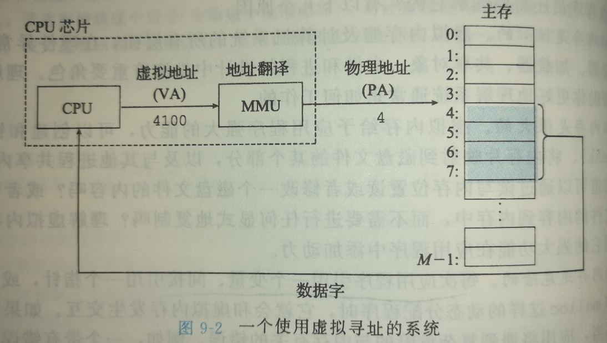


**内存管理单元(MMU)**利用存放在主存中的查询表来动态翻译虚拟地址，表的内容由操作系统管理


------

### 9.2 地址空间

地址空间(address space )是一个非负整数地址的有序集合


主存中每个字节都有一个选自虚拟地址空间的虚拟地址和一个选自物理地址空间的物理地址。


------

### 9.3 虚拟内存作为缓存的工具

#### DRAM 缓存的组织结构


#### 缺页

在PTE表中存在被引用虚拟地址对应的物理地址但是有效位为0，说明还没有缓存，此时触发缺页异常，异常处理程序选择内存中一个牺牲页，把对应物理地址的内容缓存后，修改PTE表中对应的条目，此时牺牲也变成未缓存，然后把导致缺页的虚拟地址重新发送到MMU，而后正常处理


所有现代系统都使用按需页面调度


------

### 9.4 虚拟内存作为内存管理的工具

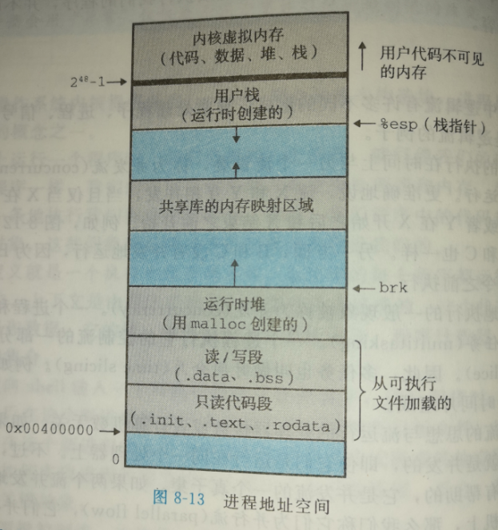


按需页面调度和独立地址空间结合：

- **简化链接**
  - 几乎每个进程都是用类似的内存格式，对于64位地址空间，代码段总是从虚拟地址0x400000开始，栈占据了用户进程空间最高的部分，并向下生长。极大简化了链接器的设计和实现，允许生成完全可链接的可执行文件。
- **简化加载**
  - 加载器从不从磁盘到内存实际复制任何数据。只是为目标文件的代码和数据分配适当的虚拟页，然后在程序真正引用代码或者数据时，虚拟内存系统才开始真正调入数据页（代码和数据）到内存中，但是在cpu看来，加载时这些已经处于内存中，内存管理系统使用内存作为缓存提供了这个假象。
- **简化共享**
  - 独立地址空间为操作系统提供一个管理用户进程和操作系统自身之间共享的一致机制。例如，当不同的进程引用相同的共享库时，在每一个进程中都有自己的地址空间，操作系统可以通过将不同的进程的虚拟页映射到相同的物理页面，更加明朗地实现实际内存中同一份代码在不同进程中的共享。
- **简化内存分配**
  - 简单的内存分配，例如，当一个程序要求额外的连续内存空间时，操作系统由于页表的工作方式，没有必要在实际内存中分配连续物理内存页面，而是将页面随机分散在物理内存中，然后映射到虚拟内存的连续虚拟页中。


------

### 9.5 虚拟内存作为内存保护的工具

在PTE表的条目上添加额外的许可位来控制对一个页面内容的访问控制

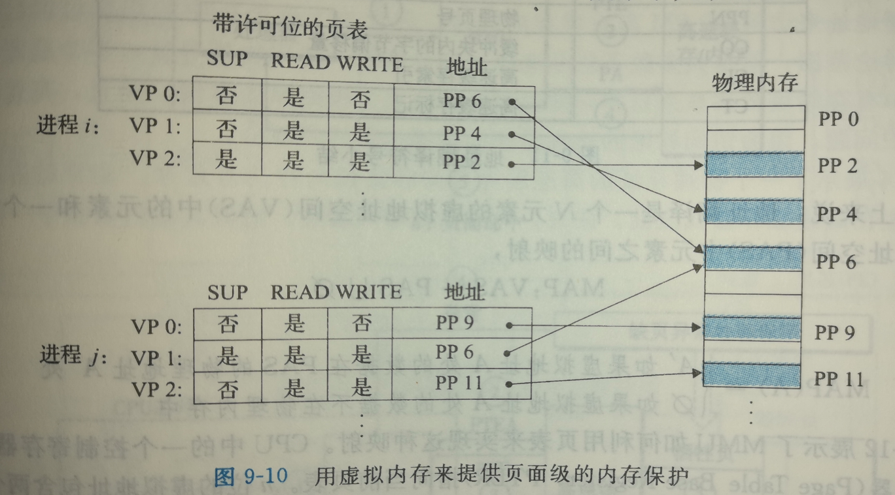


内核模式下的进程允许访问任何页面

用户模式下的进程只允许访问SUP位为0的页面

如果一条指令违反了这些许可条件，那么cpu将触发一个保护故障，称为 段错误(segmentation fault)


------

### 9.6 地址翻译

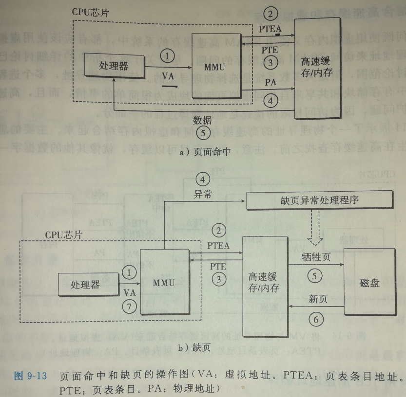


处理器发送虚拟内存地址给mmu，mmu用PTEA向内存请求PTE条目，然后mmu解析PTE得到物理地址，用物理地址请求数据，内存将数据直接发送给cpu

缺页将在解析PTE条目时，有效位为0，此时触发缺页异常处理程序，处理结束后重新执行访问内存的指令


#### 结合高速缓存和虚拟内存

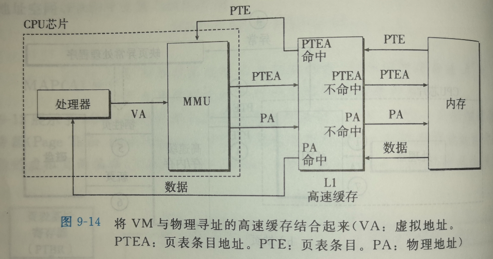


#### 利用 TLB 加速地址翻译

**翻译后备缓冲器（Translation Lookaside Buffer）**是关于PTE的小缓存


TLB块 用VPN的低t位作为组索引，确保不同组之间的高度相关联性，这点与高速缓存的关联映射相似

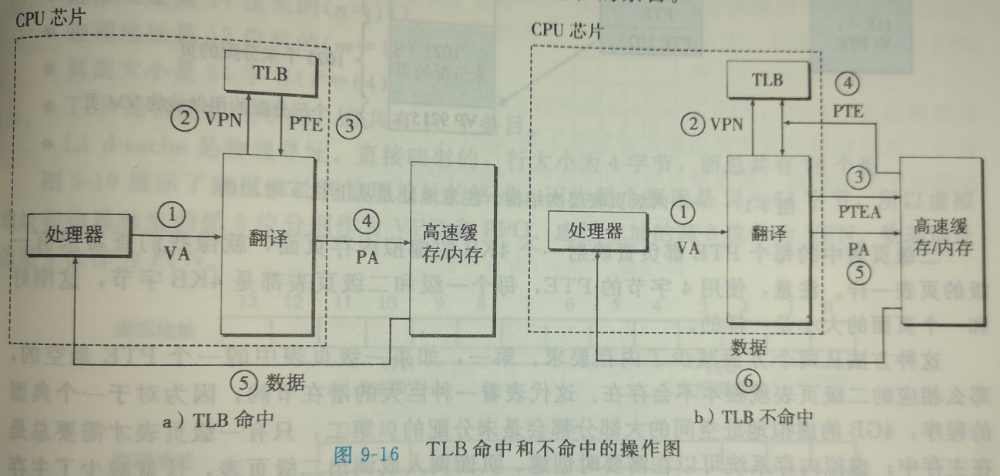


#### 多级页表

通过对页表进行分级，用低级页表指向高级页表的基址，用虚拟地址的高位索引低级的页表条目，直至索引到偏移地址，而偏移地址是相同的。

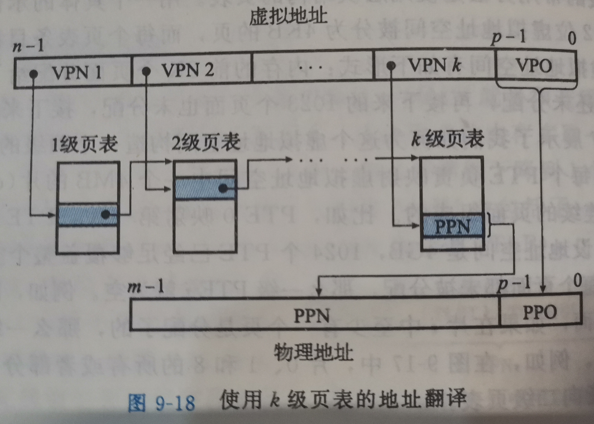

而且多级页表的地址翻译并不比单页表慢很多，ELB真是通过将不同层次上的PTE缓存起来。


#### 综合：端到端的地址翻译


**在缓存设备中，利用位模式的相对低位地址作为索引，而高位地址作为标记的这种模式比较有相关联性，因为相邻的组不会互相覆盖，如果内存中N个连续的组经常被访问，那么他们将占据缓存中的连续组，计算机程序的局部性保证了我们总是访问一段连续的内存，因此程序总能在一次访问缓存不命中后连续缓存命中**

**如果程序持续连续访问一段内存，那么缓存窗口将是定步跳跃式地进行缓存**

**另外一方面，跳跃访问将可能使这种机制陷入最糟糕的性能，即相邻两次访问是跳跃式的，如果步长刚好是组的数目，称为抖动，那么每次访问都刚好不命中然后从内存中取出一个组覆盖缓存中的一个组，这需要我们进一步了解具体硬件的机制从而避免抖动**


------

### 9.7 案例研究：Intel Core i7/Linux 内存系统

虽然Haswell微体系结构允许完全的64位虚拟和物理地址空间，而现在以及可预见的未来，Corei7 实现支持48位(256TB)虚拟地址空间和52位物理地址空间(4PB)物理地址空间，还有一个兼容模式，支持32位(4GB)虚拟和物理地址空间。


核X4

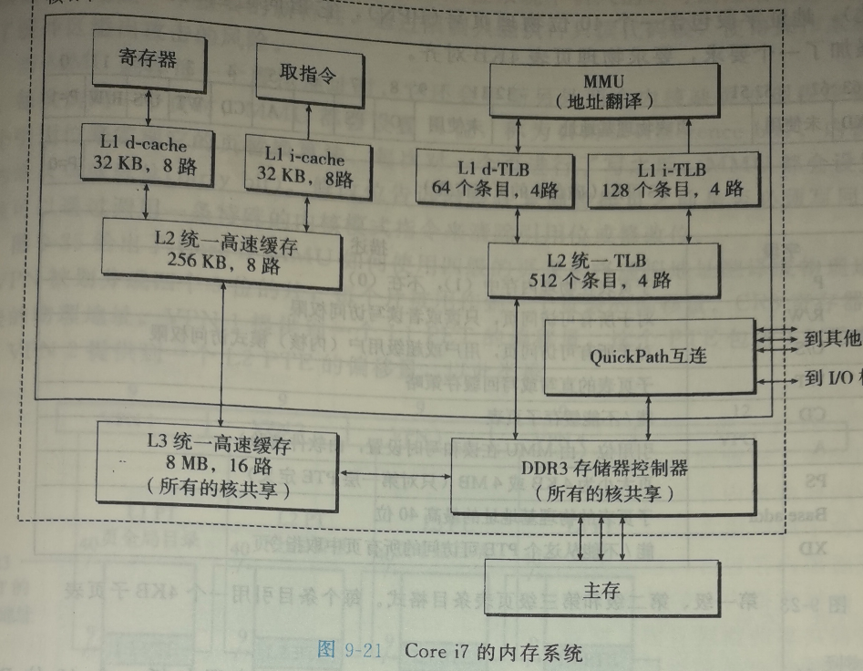


#### Core i7 地址翻译

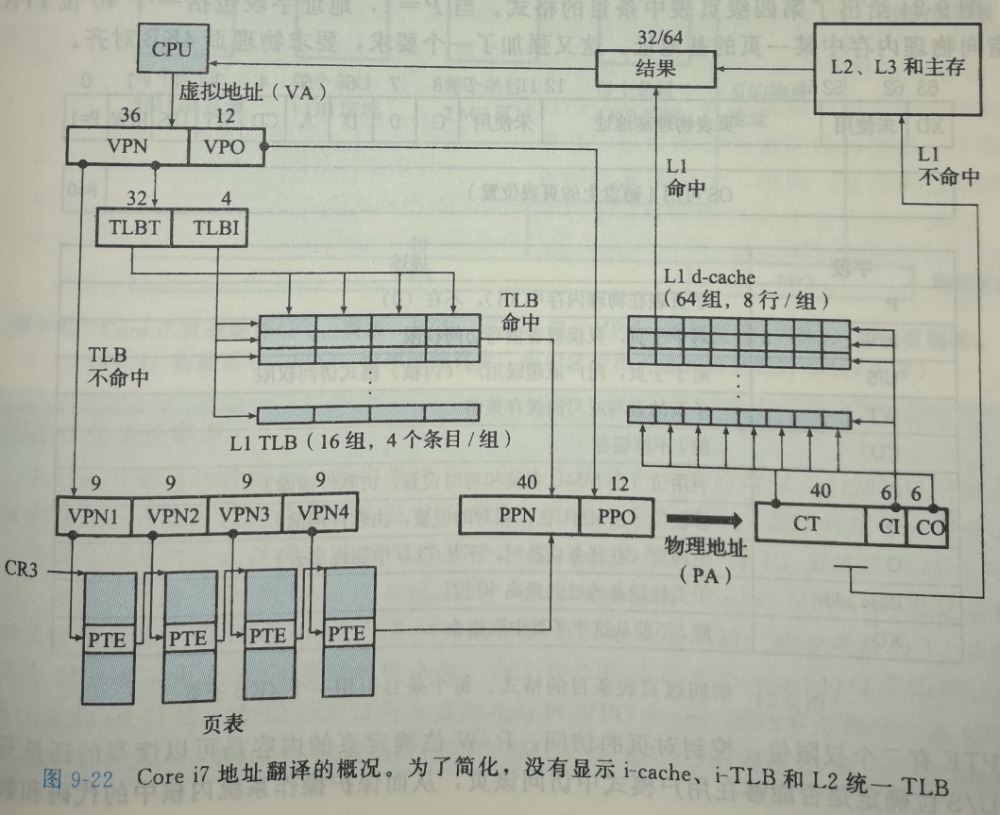


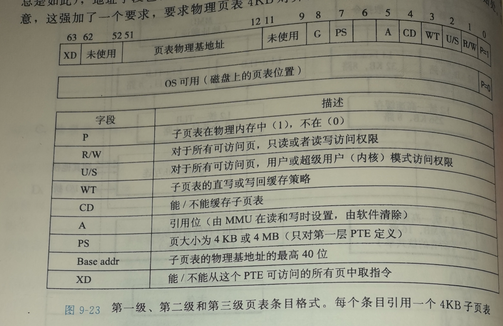

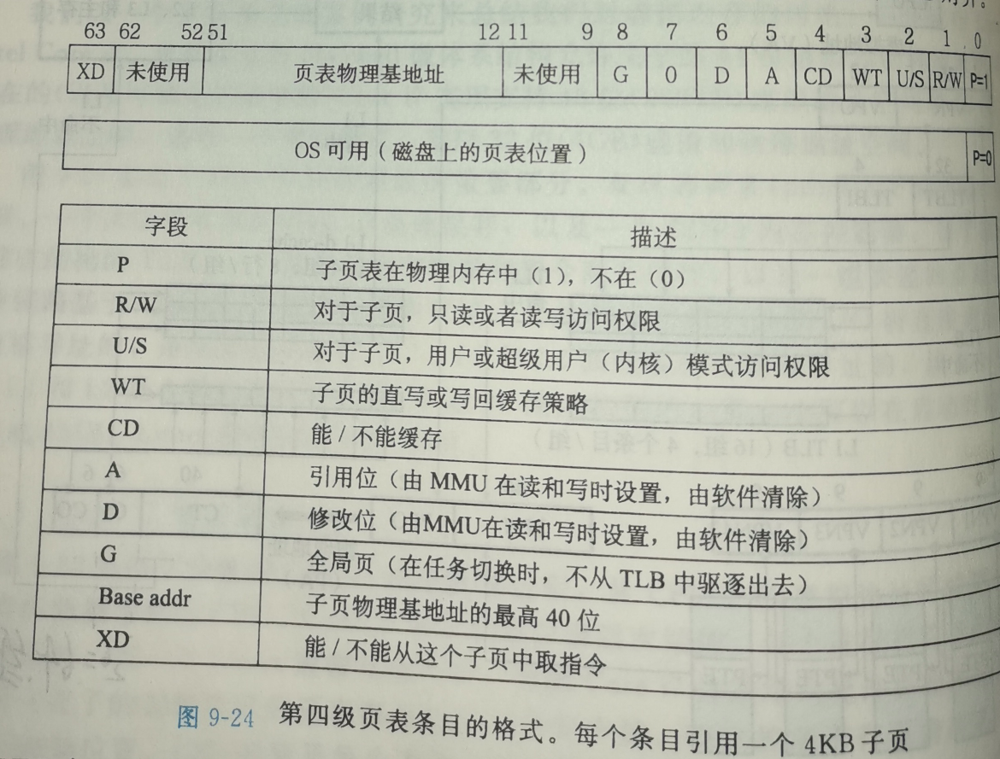

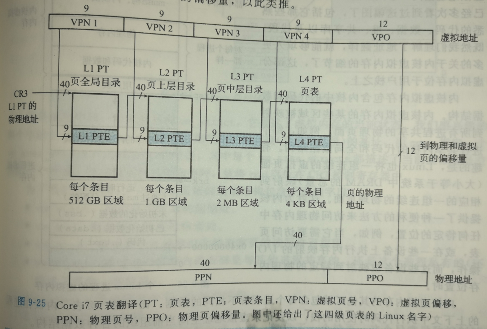


**页面大小为4kb的Core i7 ， 虚拟地址有12位的VPO，直接键VPO发送到L1高速缓存，因为64位物理寻址的L1高速缓存有64个组和64字节的缓存块，刚好是 2 * log64 = 2 * 6 = 12位，所以发送VPN给TLB时， 同时发送12位VPO对应的索引和偏位移给L1 高速缓存， 所以高速缓存可以提前准备好1个组中不同行的同一个偏位移对应的数据字，VPN被解析为物理地址时，行也就确定了，也就确定了缓存字，换言之一个物理内存页面刚好对应高速缓存中的不同组中同一行的同一个偏移量的字节**


#### Linux 虚拟内存系统


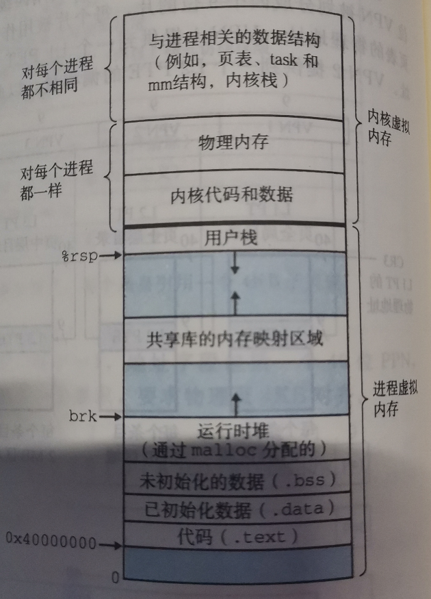


**Linux 为每个进程维护了一个单独的虚拟空间**


**Linux 也将一组连续的虚拟页面（大小等于系统中DRAM的总量）映射到相应的一组物理页面**


- **Linux 虚拟内存区域**
  - Linux将虚拟内存组织成一些区域（或者叫段）的集合，一个区域（area）就是已经存在的（已分配的）虚拟内存的连续片，这些页是以某种方式相关联的。
  - 内核为每个进程维护一个单独的任务结构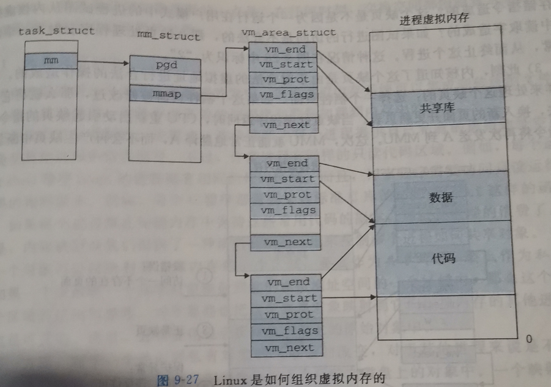
- **Linux 缺页异常处理**
  - 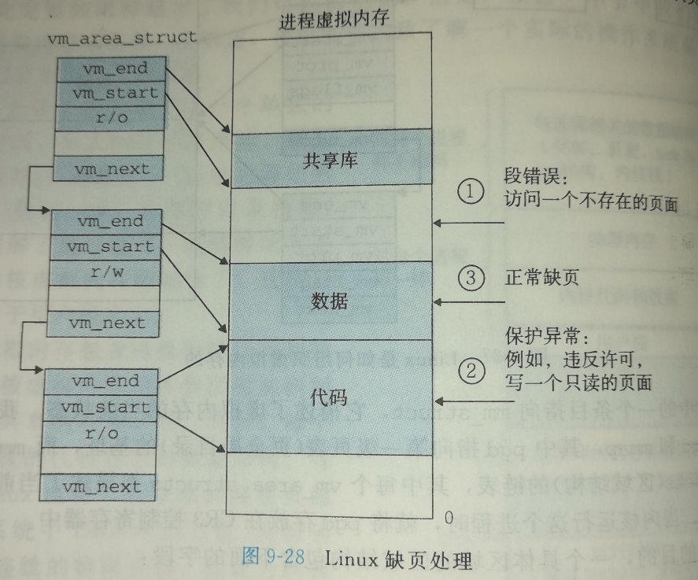


------

### 9.8 内存映射


**多个进程的内存空间存在私有的、写时复制的同一个物理对象时，某个进程进行写操作将触发保护写时复制区域的保护故障，例如fork()函数创建进程后对变量的写，处理程序在物理内存中创建被写页面的副本，并恢复可写权限，在进程的页表修改此条目指向新建页面**

​	

------

### 9.9 动态内存分配


堆向上生长，堆底位于未初始化数据区域后


内核维护着堆的顶指针brk


------

### 9.10 mallo 和 free 函数


32位机器中申请的内存块首地址总是8的倍数，而64位中则为16的倍数


```c
#include <stdlib.h>

void *malloc(size_t size);
```


```c
#include <unistd.h>

void *sbrk(intptr_t incr);//通过将brk指针增加incr来扩展和收缩堆，成功则返回旧值，否则返回-1
```


```c
#include <stdlib.h>

void free(void *ptr);//参数必须是*alloc函数获得的分配块的起始指针
```


#### 隐式空闲链表

因为块大小总是8的倍数，所以32位信息头部块大小的低3位总是0，这3位刚好可以用来指示一些别的信息，比如最低位指示是否分配。


#### 放置已分配的块

常见的放置策略：

- 首次适配：搜索链表，选择第一个大小适合的块
- 下一次适配：从上一次查询结束的位置开始搜索
- 最佳适配：选择大小适合的块中的最小块


#### 分割空闲块


#### 合并空闲块

快速的分配器通常会选择某种形式的推迟合并


#### 带边界标记的合并

在块尾加一个和头部一样的脚部

这样当一个块被释放时，可以轻松地合并前和后一个空闲块


#### 综合：实现一个简单地分配器


```c
/*
 * memlib.c - a module that simulates the memory system.  Needed
 * because it allows us to interleave calls from the student's malloc
 * package with the system's malloc package in libc.
 *
 */
#include <stdio.h>
#include <stdlib.h>
#include <assert.h>
#include <unistd.h>
#include <sys/mman.h>
#include <string.h>
#include <errno.h>

#include "csapp.h"
#include "memlib.h"
#include "config.h"

/* $begin memlib */
/* Private global variables */
static char *mem_heap;     /* Points to first byte of heap          指向堆底*/ 
static char *mem_brk;      /* Points to last byte of heap plus 1    指向堆顶*/
static char *mem_max_addr; /* Max legal heap addr plus 1            最大合法堆地址*/ 

/* 
 * mem_init - Initialize the memory system model
 */
void mem_init(void)
{
    mem_heap = (char *)Malloc(MAX_HEAP);            //调用malloc的包装函数申请一个堆，将堆底指针指向堆底
    mem_brk = (char *)mem_heap;                     //初始化已分配内存顶指针
    mem_max_addr = (char *)(mem_heap + MAX_HEAP);   //初始化堆顶指针
}

/* 
 * mem_sbrk - Simple model of the sbrk function. Extends the heap 
 *    by incr bytes and returns the start address of the new area. In
 *    this model, the heap cannot be shrunk.
 */
void *mem_sbrk(int incr) //与sbrk函数一样
{
    char *old_brk = mem_brk;

    if ( (incr < 0) || ((mem_brk + incr) > mem_max_addr)) {
	errno = ENOMEM;
	fprintf(stderr, "ERROR: mem_sbrk failed. Ran out of memory...\n");
	return (void *)-1;
    }
    mem_brk += incr;
    return (void *)old_brk;
}
/* $end memlib */

/* 
 * mem_deinit - free the storage used by the memory system model
 */
void mem_deinit(void)
{
}

/*
 * mem_reset_brk - reset the simulated brk pointer to make an empty heap
 */
void mem_reset_brk()
{
    mem_brk = (char *)mem_heap;
}

/*
 * mem_heap_lo - return address of the first heap byte
 */
void *mem_heap_lo()
{
    return (void *)mem_heap;
}

/* 
 * mem_heap_hi - return address of last heap byte
 */
void *mem_heap_hi()
{
    return (void *)(mem_brk - 1);
}

/*
 * mem_heapsize() - returns the heap size in bytes
 */
size_t mem_heapsize() 
{
    return (size_t)((void *)mem_brk - (void *)mem_heap);
}

/*
 * mem_pagesize() - returns the page size of the system
 */
size_t mem_pagesize()
{
    return (size_t)getpagesize();
}
```


```c
/* 
 * Simple, 32-bit and 64-bit clean allocator based on implicit free
 * lists, first fit placement, and boundary tag coalescing, as described
 * in the CS:APP2e text. Blocks must be aligned to doubleword (8 byte) 
 * boundaries. Minimum block size is 16 bytes. 
 */
#include <stdio.h>
#include <string.h>
#include <stdlib.h>

#include "mm.h"
#include "memlib.h"

/*
 * If NEXT_FIT defined use next fit search, else use first fit search 
 */
#define NEXT_FITx

/* $begin mallocmacros */
/* Basic constants and macros */
#define WSIZE       4       /* Word and header/footer size (bytes) */ //line:vm:mm:beginconst
#define DSIZE       8       /* Doubleword size (bytes) */
#define CHUNKSIZE  (1<<12)  /* Extend heap by this amount (bytes) */  //line:vm:mm:endconst 

#define MAX(x, y) ((x) > (y)? (x) : (y))  

/* Pack a size and allocated bit into a word */
#define PACK(size, alloc)  ((size) | (alloc)) //line:vm:mm:pack

/* Read and write a word at address p */
#define GET(p)       (*(unsigned int *)(p))            //line:vm:mm:get 取块的值
#define PUT(p, val)  (*(unsigned int *)(p) = (val))    //line:vm:mm:put 给一个块赋值

/* Read the size and allocated fields from address p */
#define GET_SIZE(p)  (GET(p) & ~0x7)                   //line:vm:mm:getsize     给一个头部，返回块大小
#define GET_ALLOC(p) (GET(p) & 0x1)                    //line:vm:mm:getalloc    给一个头部，返回是否已分配

/* Given block ptr bp, compute address of its header and footer */
#define HDRP(bp)       ((char *)(bp) - WSIZE)                      //line:vm:mm:hdrp    给一个用户块首地址，返回块头地址
#define FTRP(bp)       ((char *)(bp) + GET_SIZE(HDRP(bp)) - DSIZE) //line:vm:mm:ftrp    给一个用户块首地址，返回块尾地址

/* Given block ptr bp, compute address of next and previous blocks */
#define NEXT_BLKP(bp)  ((char *)(bp) + GET_SIZE(((char *)(bp) - WSIZE))) //line:vm:mm:nextblkp  给一个用户块，返回下一个用户块的地址
#define PREV_BLKP(bp)  ((char *)(bp) - GET_SIZE(((char *)(bp) - DSIZE))) //line:vm:mm:prevblkp  给一个用户块，返回上一个用户块的地址
/* $end mallocmacros */

/* Global variables */
static char *heap_listp = 0;  /* Pointer to first block */  
#ifdef NEXT_FIT
static char *rover;           /* Next fit rover */
#endif

/* Function prototypes for internal helper routines */
static void *extend_heap(size_t words);
static void place(void *bp, size_t asize);
static void *find_fit(size_t asize);
static void *coalesce(void *bp);
static void printblock(void *bp); 
static void checkheap(int verbose);
static void checkblock(void *bp);

/* 
 * mm_init - Initialize the memory manager 
 */
/* $begin mminit */
int mm_init(void) 
{
    /* Create the initial empty heap */
    if ((heap_listp = mem_sbrk(4*WSIZE)) == (void *)-1) //初始化堆顶为4个字，即16个字节
	return -1;

    //以下按字访问并初始化
    PUT(heap_listp, 0);                          /* Alignment padding */
    PUT(heap_listp + (1*WSIZE), PACK(DSIZE, 1)); /* Prologue header */ 
    PUT(heap_listp + (2*WSIZE), PACK(DSIZE, 1)); /* Prologue footer */ 
    PUT(heap_listp + (3*WSIZE), PACK(0, 1));     /* Epilogue header */
    heap_listp += (2*WSIZE);                     //将堆底指向序言块的脚部
/* $end mminit */

#ifdef NEXT_FIT
    rover = heap_listp;
#endif
/* $begin mminit */

    /* Extend the empty heap with a free block of CHUNKSIZE bytes */
    if (extend_heap(CHUNKSIZE/WSIZE) == NULL) //创建1^10字大小的空闲块
	    return -1;
    return 0;
}
/* $end mminit */

/* 
 * mm_malloc - Allocate a block with at least size bytes of payload 
 */
/* $begin mmmalloc */
void *mm_malloc(size_t size) 
{
    size_t asize;      /* Adjusted block size */
    size_t extendsize; /* Amount to extend heap if no fit */
    char *bp;      

/* $end mmmalloc */
    if (heap_listp == 0){
	    mm_init();
    }
/* $begin mmmalloc */
    /* Ignore spurious requests */
    if (size == 0)
	    return NULL;

    /* Adjust block size to include overhead and alignment reqs. */
    if (size <= DSIZE)                                          //line:vm:mm:sizeadjust1
	    asize = 2*DSIZE;                                        //line:vm:mm:sizeadjust2
    else
	    asize = DSIZE * ((size + (DSIZE) + (DSIZE-1)) / DSIZE); //向上取舍

    /* Search the free list for a fit */
    if ((bp = find_fit(asize)) != NULL) {  //line:vm:mm:findfitcall
	    place(bp, asize);                  //line:vm:mm:findfitplace
	    return bp;
    }

    /* No fit found. Get more memory and place the block */
    extendsize = MAX(asize,CHUNKSIZE);                 //line:vm:mm:growheap1
    if ((bp = extend_heap(extendsize/WSIZE)) == NULL)  
	return NULL;                                  //line:vm:mm:growheap2
    place(bp, asize);                                 //line:vm:mm:growheap3
    return bp;
} 
/* $end mmmalloc */

/* 
 * mm_free - Free a block 
 */
/* $begin mmfree */
void mm_free(void *bp)
{
/* $end mmfree */
    if(bp == 0) 
	return;

/* $begin mmfree */
    size_t size = GET_SIZE(HDRP(bp));
/* $end mmfree */
    if (heap_listp == 0){
	mm_init();
    }
/* $begin mmfree */

    PUT(HDRP(bp), PACK(size, 0));
    PUT(FTRP(bp), PACK(size, 0));
    coalesce(bp);
}

/* $end mmfree */
/*
 * coalesce - Boundary tag coalescing. Return ptr to coalesced block
 */
/* $begin mmfree */
static void *coalesce(void *bp) 
{
    size_t prev_alloc = GET_ALLOC(FTRP(PREV_BLKP(bp))); //前一个块是否已分配
    size_t next_alloc = GET_ALLOC(HDRP(NEXT_BLKP(bp))); //后一个块是否已分配
    size_t size = GET_SIZE(HDRP(bp));                   //当前块的大小

    if (prev_alloc && next_alloc) {            /* Case 1 */
	    return bp;
    }

    else if (prev_alloc && !next_alloc) {      /* Case 2 */
        size += GET_SIZE(HDRP(NEXT_BLKP(bp)));              
        PUT(HDRP(bp), PACK(size, 0));
        PUT(FTRP(bp), PACK(size,0));
    }

    else if (!prev_alloc && next_alloc) {      /* Case 3 */
        size += GET_SIZE(HDRP(PREV_BLKP(bp)));
        PUT(FTRP(bp), PACK(size, 0));
        PUT(HDRP(PREV_BLKP(bp)), PACK(size, 0));
        bp = PREV_BLKP(bp);
    }

    else {                                     /* Case 4 */
        size += GET_SIZE(HDRP(PREV_BLKP(bp))) + 
            GET_SIZE(FTRP(NEXT_BLKP(bp)));
        PUT(HDRP(PREV_BLKP(bp)), PACK(size, 0));
        PUT(FTRP(NEXT_BLKP(bp)), PACK(size, 0));
        bp = PREV_BLKP(bp);
    }
/* $end mmfree */
#ifdef NEXT_FIT
    /* Make sure the rover isn't pointing into the free block */
    /* that we just coalesced */
    if ((rover > (char *)bp) && (rover < NEXT_BLKP(bp))) 
	rover = bp;
#endif
/* $begin mmfree */
    return bp;
}
/* $end mmfree */

/*
 * mm_realloc - Naive implementation of realloc
 */
void *mm_realloc(void *ptr, size_t size)
{
    size_t oldsize;
    void *newptr;

    /* If size == 0 then this is just free, and we return NULL. */
    if(size == 0) {
	mm_free(ptr);
	return 0;
    }

    /* If oldptr is NULL, then this is just malloc. */
    if(ptr == NULL) {
	return mm_malloc(size);
    }

    newptr = mm_malloc(size);

    /* If realloc() fails the original block is left untouched  */
    if(!newptr) {
	return 0;
    }

    /* Copy the old data. */
    oldsize = GET_SIZE(HDRP(ptr));
    if(size < oldsize) oldsize = size;
    memcpy(newptr, ptr, oldsize);

    /* Free the old block. */
    mm_free(ptr);

    return newptr;
}

/* 
 * checkheap - We don't check anything right now. 
 */
void mm_checkheap(int verbose)  
{ 
}

/* 
 * The remaining routines are internal helper routines 
 */

/* 
 * extend_heap - Extend heap with free block and return its block pointer
 */
/* $begin mmextendheap */
static void *extend_heap(size_t words) 
{
    char *bp;
    size_t size;

    /* Allocate an even number of words to maintain alignment */
    size = (words % 2) ? (words+1) * WSIZE : words * WSIZE;     //双字对齐
    if ((long)(bp = mem_sbrk(size)) == -1)  
	    return NULL;                                        //line:vm:mm:endextend

    /* Initialize free block header/footer and the epilogue header */
    PUT(HDRP(bp), PACK(size, 0));         /* Free block header */   //line:vm:mm:freeblockhdr
    PUT(FTRP(bp), PACK(size, 0));         /* Free block footer */   //line:vm:mm:freeblockftr
    PUT(HDRP(NEXT_BLKP(bp)), PACK(0, 1)); /* New epilogue header */ //line:vm:mm:newepihdr

    /* Coalesce if the previous block was free */
    return coalesce(bp);                                          //line:vm:mm:returnblock
}
/* $end mmextendheap */

/* 
 * place - Place block of asize bytes at start of free block bp 
 *         and split if remainder would be at least minimum block size
 */
/* $begin mmplace */
/* $begin mmplace-proto */
static void place(void *bp, size_t asize)	//每次返回请求块都需要调用分割
     /* $end mmplace-proto */
{
    size_t csize = GET_SIZE(HDRP(bp));   

    if ((csize - asize) >= (2*DSIZE)) { 	//如果剩余部分足够开始一个新的未分配块
		PUT(HDRP(bp), PACK(asize, 1));
        PUT(FTRP(bp), PACK(asize, 1));
        bp = NEXT_BLKP(bp);					//向后分割
        PUT(HDRP(bp), PACK(csize-asize, 0));
        PUT(FTRP(bp), PACK(csize-asize, 0));
    }
    else { 
        PUT(HDRP(bp), PACK(csize, 1));		//否则维持原来的尺寸并设置分配位
        PUT(FTRP(bp), PACK(csize, 1));
    }
}
/* $end mmplace */

/* 
 * find_fit - Find a fit for a block with asize bytes 
 */
/* $begin mmfirstfit */
/* $begin mmfirstfit-proto */
static void *find_fit(size_t asize)
/* $end mmfirstfit-proto */
{
/* $end mmfirstfit */

#ifdef NEXT_FIT 
    /* Next fit search */
    char *oldrover = rover;

    /* Search from the rover to the end of list */
    for ( ; GET_SIZE(HDRP(rover)) > 0; rover = NEXT_BLKP(rover))
	if (!GET_ALLOC(HDRP(rover)) && (asize <= GET_SIZE(HDRP(rover))))
	    return rover;

    /* search from start of list to old rover */
    for (rover = heap_listp; rover < oldrover; rover = NEXT_BLKP(rover))
	if (!GET_ALLOC(HDRP(rover)) && (asize <= GET_SIZE(HDRP(rover))))
	    return rover;

    return NULL;  /* no fit found */
#else 
/* $begin mmfirstfit */
    /* First fit search */
    void *bp;

    for (bp = heap_listp; GET_SIZE(HDRP(bp)) > 0; bp = NEXT_BLKP(bp)) {     //heap_listp指向序言块的脚部，相当于指向一个可用负荷为0的已分配块
        if (!GET_ALLOC(HDRP(bp)) && (asize <= GET_SIZE(HDRP(bp)))) {        //采用首次匹配策略，当找到匹配块时立即返回
            return bp;
        }
    }
    return NULL; /* No fit */
/* $end mmfirstfit */
#endif
}

static void printblock(void *bp) 
{
    size_t hsize, halloc, fsize, falloc;

    checkheap(0);
    hsize = GET_SIZE(HDRP(bp));
    halloc = GET_ALLOC(HDRP(bp));  
    fsize = GET_SIZE(FTRP(bp));
    falloc = GET_ALLOC(FTRP(bp));  

    if (hsize == 0) {
	printf("%p: EOL\n", bp);
	return;
    }

    /*  printf("%p: header: [%p:%c] footer: [%p:%c]\n", bp, 
	hsize, (halloc ? 'a' : 'f'), 
	fsize, (falloc ? 'a' : 'f')); */
}

static void checkblock(void *bp) 
{
    if ((size_t)bp % 8)
	printf("Error: %p is not doubleword aligned\n", bp);
    if (GET(HDRP(bp)) != GET(FTRP(bp)))
	printf("Error: header does not match footer\n");
}

/* 
 * checkheap - Minimal check of the heap for consistency 
 */
void checkheap(int verbose) 
{
    char *bp = heap_listp;

    if (verbose)
	printf("Heap (%p):\n", heap_listp);

    if ((GET_SIZE(HDRP(heap_listp)) != DSIZE) || !GET_ALLOC(HDRP(heap_listp)))
	printf("Bad prologue header\n");
    checkblock(heap_listp);

    for (bp = heap_listp; GET_SIZE(HDRP(bp)) > 0; bp = NEXT_BLKP(bp)) {
	if (verbose) 
	    printblock(bp);
	checkblock(bp);
    }

    if (verbose)
	printblock(bp);
    if ((GET_SIZE(HDRP(bp)) != 0) || !(GET_ALLOC(HDRP(bp))))
	printf("Bad epilogue header\n");
}
```

初始化堆参数之后，初始化堆头部、脚部和尾标志，申请一个大小为CHUNKSIZE的片作为


#### 分离的空闲链表


- 简单分离储存
  - 链表主体还是在堆中，空闲块中有一个指针指向下一个同样大小的空闲块，维护一个数组记录每一个同样大小的空闲块链表首地址
  - 请求分配快，检索相应的空闲链表，非空就直接分配第一块，空就向系统请求一个固定大小的内存片，然后分成大小相等的块
- 分离适配
  - 为了分配一个快，先确定请求大小类，查找适配，如果找到了一个，分割，将剩余部分插入适当的空闲链表，如果一直找不到适配的链表，就申请额外堆内存，一般是固定大小的，然后分割，一部分作为请求块，一部分插入相应空闲链表
  - 释放一个块，执行合并，将其放置到相应链表
  - **GNU malloc函数**正是使用这种策略，有趣的是这种简单的分离空闲链表的首次适配搜索，非常接近最佳适配搜索的内存利用率，而且很明显这种策略的性能更高
- 伙伴系统
  - 假设一个堆的大小为2 ^ m个字，维护一个数组分离2 ^ k 大小的空闲链表，其中 0 <=  k <= m
  - 请求快向上舍入到最接近的2的幂，为了分配一个2 ^ k的块，找到第一个可用的、大小为2 ^ j的块，其中 k <= j <= m, 梯柜地二分目标块，如果 j = k，那么返回这个块，在递归过程中，将每次分割出的另一部分加入空闲链表中
  - 给定一个块，我们很容易计算出它的伙伴。例如，有一个32字节的块，地址为0xaaaaa...a00000，那么它的伙伴的地址为0xaaaaa...a10000，反之亦然。
  - 快速合并和快速键索，缺点是碎片太多，在已知块大小总是2的幂时可以考虑。


------

### 9.10 垃圾收集

#### 垃圾回收器

根结点为一种不在堆中的位置，比如寄存器，栈变量，虚拟内存中读写数据区内的全局变量

非根结点为堆中的块

malloc包中有一个保守的收集器，因为它不能精确表达可达图


#### Mark & Sweep 垃圾收集器

分为两个阶段：

- 标记可达堆结点。利用深度优先算法，将一个根结点可达的结点标记
- 释放不可达堆结点。将没有被标记而且已分配的块释放


#### C 程序的保守 Mark & Sweep

C语言不会用类型信息标记内存位置。因此分配器只能保守地将所有堆结点值认为是指针，所以必然有非可达的结点被标记为可达的。


------

### 9.11 C 程序中常见的与内存相关的错误

malloc并不会初始化请求的内存，calloc则会将请求内存初始化为0


gets可以无限读


